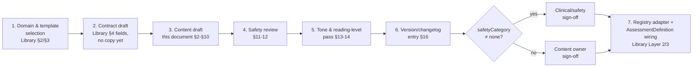
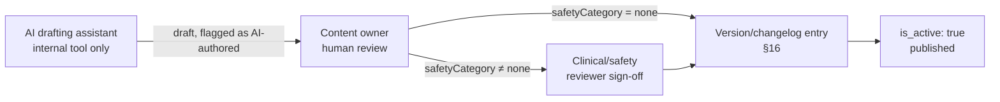

# The Rooted Reset Coaching Content Framework

**Prompt 7 deliverable — architecture and specification only (no production code, no questionnaires
written yet)**
MEF Wellness · Governed by [The Rooted Reset Method, v2](./METHODOLOGY.md),
[the Focused Investigation Library](./FOCUSED-INVESTIGATION-LIBRARY.md),
[the Root Model and Router](./ROOT-MODEL-AND-ROUTER.md)
Status: **draft — the last architecture document before implementation begins**

---

## 0. How to read this document

Prompts 5 and 6 defined how investigations are *built* and how the platform *reasons* over what
they produce. This document defines how their actual words get written — by a human, or drafted
by AI and approved by a human (§17) — so that a coach reading a member's screen, a member reading
their own Root Map, and a coach reading their own dashboard never sound like they came from three
different products.

**This is not a green-field style guide.** Real, live content and content *rules* already exist
scattered across the codebase — a real medical disclaimer, a real five-tier safety classification
system with versioned templates, a real "never claim causation" discipline, a real coaching-copy
shape. This document's main job is to **consolidate those into one authoritative framework** and
fill the genuine gaps (a question-writing framework, a reading-level target, an AI/coach authoring
workflow) that don't have a real precedent yet — each one flagged as new where it is.

**Real content precedent this document builds on:**

| Real source | What it already establishes |
|---|---|
| `lib/consent/copy.ts` (`CONSENT_ITEMS`, `CONSENT_VERSION`) | The platform's real medical disclaimer (`wellness_education_disclaimer`) and AI-processing disclosure (`ai_assisted_processing`), both versioned. |
| `safety_message_templates` (migration `00000000000028`) | Five real classification levels, and the rule that safety-tier copy is "approved, versioned... never freeform-generated." |
| `lib/intelligence/copy.ts`, `lib/narrative/generator.ts` | The real "correlation, never causation" wording discipline already enforced across two subsystems. |
| `lib/wellness/coaching.ts` (`WELLNESS_COACHING`) | The real title / why-this-matters / one-concrete-action copy shape, already shared between member and coach views. |
| `lib/onboarding/scale.ts`, `lib/onboarding/baseline.ts` | Real endpoint-labeled numeric scales, real `not_sure`/`not_applicable`/`prefer_not_to_answer` skip convention, real snake_case-to-label formatting. |
| `lib/assessment-registry/types.ts` | The established rule: internal questionnaire names and ids never reach member-visible copy. |
| `lib/intelligence-engine/hypotheses.ts` (Prompt 6) | The real three-way separation (known facts / likely patterns / possible explanations) plus required alternatives. |

---

## 1. How every investigation is authored — the pipeline

**Content is never drafted before the contract.** This mirrors the whole document series' own
practice — architecture before content (Prompt 3 before Prompt 4) — applied now as a permanent
rule for every future investigation, not just the Foundational one: an author fills in domain
mapping, unlock trigger, reassessment cadence, and Root Model contribution shape (Library §4)
*before* writing a single question, so every question can be checked against "does this actually
serve the contract" rather than the contract being reverse-engineered from whatever got written.

---

## 2. Writing standards — the non-negotiables

1. **Never diagnose. State association, never causation.** "Tends to," "often coincides with,"
   "may be connected to" — never "causes," "means," "proves." This is not a new rule; it is the
   real, already-enforced discipline from `lib/intelligence/copy.ts` and `lib/narrative/
   generator.ts`, extended to every investigation's own copy.
2. **Never surface an internal engineering name.** No questionnaire id, engine name, or internal
   `question_key` in anything a member or coach reads as prose — the Assessment Registry's own
   established rule, unchanged.
3. **Every claim traces to something the Root Model actually knows about this member.** No stock
   advice presented as personalized (Method principle 1) — if a sentence would be true for any
   member regardless of their answers, it doesn't belong in personalized copy.
4. **Curiosity-voiced, never verdict-voiced.** "What we're noticing," "worth watching" — never
   "you have," "you are" (Method v2 §1's "note on stance," restated as an enforceable writing rule
   here, not just a philosophical stance).
5. **One library, one voice.** No investigation's copy should read as if it came from a different
   brand or a licensed third-party instrument — Method principle 3, and the standing rule that no
   investigation is ever presented as a certification or vendor system.
6. **No new clinical-certification terminology**, in any investigation's copy, ever.
7. **Every question and every branch must earn its place.** It must be traceable to reducing real
   uncertainty about the member (Method principle 5, Prompt 4 §3's concrete one-sentence test) —
   applied at authoring time, not just at the architecture level.

---

## 3. Question-writing framework

*(New — no direct real precedent existed for this before Prompt 4's Foundational Investigation;
this generalizes what worked there.)*

- **One idea per question.** A compound question ("how do you sleep and how stressed are you") is
  two questions with one answer slot — split it.
- **Structured answers by default; free text only when it can't be enumerated.** Prompt 4's real
  ratio (17 structured items to 2 open reflections) is the reference proportion — free text is the
  exception, not the default, because it can't be scored, branched on cleanly, or read at a glance
  by a coach.
- **Every question must be answerable by someone who has never seen a wellness questionnaire
  before.** No compound clinical terms, no jargon a member would need to look up.
- **Every question's authoring notes (never shown to the member) must state which Coaching
  Domain and which specific Root Model signal it produces** — Library §4's requirements 1 and 4,
  applied at the individual-question level, not just the instrument level as a whole.
- **Numeric scales are always endpoint-labeled**, reusing `lib/onboarding/scale.ts`'s real
  convention (e.g. "Very Poor" / "Excellent") — a bare 1–5 with no labeled direction is never
  acceptable.
- **Anchor to a recent, real timeframe** — "lately," "most days," "in the past couple of weeks" —
  never a vague "generally," which invites an identity-level self-assessment instead of a
  point-in-time Signal (Method v2 §2's own definition of what a Signal is).

---

## 4. Answer option standards

- **Mutually exclusive, collectively exhaustive.** Always include the true edge case (a real
  "none" option, per `baseline_pain_areas`'s own precedent) where one exists.
- **Always offer a way out**, using the platform's real three flags (`allows_not_sure`,
  `allows_not_applicable`, `allows_prefer_not_to_answer`) — every Focused Investigation extends
  this convention, not just the Foundational Investigation.
- **Options are written in the member's likely own words**, not clinical register — "up and down,"
  not "affective lability."
- **Snake_case internal values, human-readable labels** — the real underscore-to-space convention
  `formatAnswerValue` already establishes stays the standard split between what's stored and what's
  shown.
- **Numeric ranges stay 1–5 or 0–10** — the two real ranges `numericRange()` already defines.
  Don't introduce a third arbitrary scale for a new investigation.
- **No option reads as the "correct" one.** Nothing about an option's wording or position should
  signal which answer would please a coach or look better on a report.

---

## 5. Branching standards — the writing layer

*(Distinct from Library §5's structural/logic branching rules — this is how to write the copy for
a branch that logic already permits.)*

- **A follow-up never re-asks what's already known.** Reference the prior answer naturally where it
  helps ("How much does that discomfort affect your daily life right now?" directly continues from
  a just-reported pain area — Prompt 4's real pain-cascade precedent).
- **A branch must read as a continuation, not a topic change.** No jarring register or subject
  shift between a base item and its follow-up.
- **Depth and length move in opposite directions.** Library §5 caps cascade depth at three levels;
  this document adds that each additional level's copy should get *shorter*, not longer — a member
  already investing extra effort in a follow-up deserves less to read, not more.

---

## 6. Educational content standards

- **Every piece of education content ties to a real signal or domain.** Mirrors the real trigger
  behind `educationRecommendation()` (Prompt 6 §7): it only fires when a trend is
  `newly_emerging` — education is offered exactly when something new just appeared, never as
  generic filler unconnected to what's actually known.
- **Education content never crosses into a disclaimer-covered clinical claim.** The real
  `wellness_education_disclaimer` wording ("educational, non-diagnostic... not a substitute for
  professional medical advice") is the line education copy must never cross, in either direction —
  neither implying a diagnosis nor implying medical advice is unnecessary.
- **Short-form by default, in the real three-part shape**: title, why-this-matters, one concrete
  action — reusing `WELLNESS_COACHING`'s exact structure rather than inventing a new template per
  investigation.

---

## 7. Coach note standards

- **A more direct register than member-facing copy is allowed — a diagnosis is still never
  allowed.** Coach notes can be clinically precise about what was observed; they still can't cross
  into diagnosing, consistent with the platform-wide coaching/clinical boundary (Library §12).
- **Every coach note cites its evidence.** Mirrors the `evidence_refs`/`evidenceRefs` requirement
  already enforced everywhere in the Intelligence Engine (Prompt 6) — a coach-facing claim with no
  traceable evidence reference is held to the same bar as a member-facing one.
- **Coach notes use the same three-way separation as `RootCauseHypothesis`** — known facts / likely
  patterns / possible explanations, plus at least one alternative explanation (Prompt 6 §6). This
  document adopts that structure as the mandatory template for any hand-written coach note content,
  not only the algorithmically-generated hypotheses it originated from.

---

## 8. Member insight standards

- **Every insight is traceable to a signal the member recognizes as their own.** An insight that
  could plausibly describe any member is not a member insight.
- **Reuse `WELLNESS_COACHING`'s title/why/action shape** as the standard template — the same
  discipline as §6, applied to insights specifically rather than education content.
- **Never show a raw confidence number or severity score.** Always translate through the plain-
  language mapping Prompt 4 §8 already established for the Foundational Investigation's completion
  screen — this is now the standard for every investigation's results, not just that one.
- **Second person, always.** "You," "your" — the one formatting rule that structurally separates
  member voice (§8) from coach voice (§7, third person / clinical register).

---

## 9. Lifestyle Experiment writing standards

- **All five parts of Method §8's shape are written, none optional**: Hypothesis, Protocol,
  Tracking, Reflection, Outcome.
- **Protocol copy is an invitation, never a prescription.** "Let's try," "see what happens if" —
  never "you must," "you should." This is the copy-level enforcement of what an Experiment
  *is* by definition (Method v2 §2) — a small, reversible test, not a mandate.
- **Outcome options are always the same four**: worked / partially worked / didn't work /
  inconclusive (Method §8). No Experiment gets a custom outcome scale — cross-Experiment
  comparability depends on this staying fixed.
- **Scope is stated explicitly in the copy itself** — "for the next two weeks, just this one
  thing" — so the member never expands the Experiment's scope beyond what was actually designed
  (1–3 changes, 1–4 weeks, Method §8).
- **When a safety/readiness gate blocks an Experiment, the copy always names a specific
  alternative — never a silent decline.** Reuses the Prescription Intelligence Engine's real
  pattern (Prompt 6 §9: "declines to prescribe... and instead recommends a specific alternative,
  rather than guessing") as the standard for what gets written when any Experiment is blocked.

---

## 10. Reflection prompt standards

- **Short, single-question, no branching** — Method §9's own definition of what makes a Reflection
  a Reflection, not a Reassessment.
- **Always anchored to something specific** — an active Experiment, or a general check-in moment —
  never a free-floating prompt with nothing to connect it to what's currently happening for the
  member.
- **Never asks the member to compare against a past state.** "How does this compare to before" is
  a Reassessment question, not a Reflection one (Method §9's own table: Reflection "compares
  against nothing"). This is a real, enforceable writing-level test that distinguishes the two
  instrument types at the sentence level, not just the architecture level.

---

## 11. Safety language

Every investigation's copy must be written to the register appropriate to the real classification
level it could produce (`safety_message_templates.classification_level`):

| Classification level (real) | Writing register |
|---|---|
| `standard_coaching` | Normal coach voice — no special framing needed. |
| `coaching_with_caution` | A brief, non-alarming caveat ("worth keeping an eye on") — no escalation in tone. |
| `medical_evaluation_recommended` | Explicit, warm referral language — "worth mentioning to a healthcare provider" — never diagnostic, never urgent-sounding unless the situation genuinely is. |
| `coach_review_required` | The member sees a calm "your coach will follow up" message — never the internal reasoning behind the flag (Prompt 4 §9's established precedent, generalized to every investigation). |
| `safety_response_only` | **Never freeform-authored per investigation.** This tier exclusively uses the platform's existing `safety_message_templates` — approved and versioned centrally. No investigation's own content pipeline (§1) ever originates copy at this tier. |

This table is the concrete, applied version of the boundary Prompt 4 §10 and Library §12 already
established: no investigation invents its own crisis-tier language, and no investigation's content
authoring process reaches into territory that requires the dedicated clinical/legal review those
two documents already called for.

---

## 12. Medical disclaimer framework

- **Every investigation inherits the platform-level disclaimer** — the real
  `wellness_education_disclaimer` consent item, shown once at signup, not re-shown or rewritten
  per investigation.
- **An investigation-specific caveat is always an addition, never a replacement.** Body
  Assessment's movement/injury-risk framing is the real precedent: it adds context on top of the
  standard disclaimer, it doesn't author a competing one.
- **Disclaimer-adjacent content changes trigger a `CONSENT_VERSION` review, not just an
  instrument-version bump.** If a content change touches how the platform frames medical scope
  (not just an individual investigation's own wording), that's a platform-level consent question,
  and the real `CONSENT_VERSION` mechanism — not this document's instrument-level versioning (§16)
  — is the correct place to record it.
- **The AI-processing disclosure already covers Root Model analysis.** The real
  `ai_assisted_processing` consent item already discloses that check-in/assessment data is
  analyzed by automated systems to surface patterns — a new investigation doesn't need its own
  separate AI disclosure unless it introduces a materially new *kind* of automated processing
  beyond what that item already describes.

---

## 13. Tone of voice

A compact, consolidated style guide — every line below already reflected somewhere in real code;
this is the first place they're gathered into one statement:

- Warm, curious, plain-spoken coach. Never clinical, never corporate, never falsely cheerful.
- Second person for the member ("you," "your"); "we" for the platform/Method itself ("we're
  noticing," "we'd like to understand more").
- Correlation-safe vocabulary only: "tends to," "often coincides with," "may be connected to" —
  never "causes," "means," "proves."
- Confidence is always hedged in plain language, following Prompt 4 §8's completion-screen
  pattern — never a bare number, never false certainty.
- Active voice, short sentences, contractions welcome ("you're," "it's") — an informal-professional
  register, not stiff or legalistic (outside of the disclaimer itself, §12, which stays precise on
  purpose).
- No gamified or falsely upbeat language on a pain, mood, or safety-adjacent question — forced
  enthusiasm has no place next to a health topic a member may be finding difficult.

---

## 14. Reading level

*(New — no explicit target existed anywhere in the codebase before this document; the real
existing copy — consent items, `WELLNESS_COACHING` — already reads comfortably within the range
proposed below, so this formalizes an existing practice rather than changing direction.)*

- **Target: 6th–8th grade reading level** for all member-facing copy (the same range standard
  plain-language health-communication guidance — CDC/NIH-style — already recommends), verified by
  a standard readability measure (e.g. Flesch-Kincaid) at content-review time (§1, stage 5).
- **Coach-facing content** (coach notes, the Root Cause Signals view) may run higher, since it's
  read by a trained professional — but still may never use diagnostic jargon (§7's own limit).
- **Sentence length ceiling: ~20 words** as a default; one idea per sentence.
- **Avoid nested clauses and passive voice** in member-facing copy specifically — both real,
  already-followed patterns in the existing consent and coaching copy, formalized here as a rule
  going forward rather than a coincidence of the current copy's quality.

---

## 15. Reassessment writing rules

- **Never a verbatim repeat of the original.** Per Method §9, a Reassessment compares against the
  *most recent prior instance* — its framing should say so where natural ("since we last checked
  in on this...") rather than reading as a cold first-time ask.
- **Never ask the member to self-report whether they've improved before showing the real
  comparison.** The comparison is computed from actual answers (the same discipline
  `onboarding-comparator`/`ComparisonMetric` already follows) — asking the member to guess first
  invites recency bias into copy that should stay evidence-led.
- **Completion copy follows the same confidence/priority language rules as a first-time
  completion** (§13) — a returning member doesn't get a different voice, only different content.

---

## 16. Version control for investigations

- **In-place update vs. version bump follows Library §17's existing rule**: wording-only changes
  that don't touch scoring bands or domain mapping stay in place; anything that does gets a version
  bump.
- **New in this document: a content changelog entry is required for any change to tone, disclaimer
  text, or safety-tier language — even when it doesn't require a full version bump.** Member-facing
  trust-sensitive language changing silently is a different risk category from a scoring threshold
  changing, even though the underlying mechanism (edit-in-place vs. bump) can be the same.
- **One version number per instrument — never a separate "copy version."** Content and
  scoring/logic share `currentVersion` (Library §17); this document does not introduce a fourth
  parallel versioning scheme on top of the ones already documented across Prompts 5–6.

---

## 17. AI/coach authoring workflow (internal only, not public-facing)

This governs how content gets *drafted* — never a member-facing feature, never described to a
member as "AI-generated." It extends the real discipline `safety_message_templates` already
enforces ("approved, versioned... never freeform-generated") to *all* investigation content, not
only the safety tier.

1. **AI may draft** question text, options, education copy, and coach-note templates. A draft is
   always exactly that — never auto-published.
2. **A named human must approve before anything goes live.** Where `safetyCategory ≠ none`
   (Library §12), that human is specifically a clinical/safety reviewer, not just a content owner —
   the same dedicated-review requirement Prompt 4 §10 and Library §12 already established for any
   safety-adjacent content, restated here as binding on AI-assisted drafts with equal or greater
   force.
3. **Every AI-drafted passage is flagged as such internally** — an authoring-metadata field, never
   member-visible — so a reviewer always knows which text was AI-drafted versus hand-written. This
   is for traceability, not to lower or raise the review bar; the review standard in §1–§16 is
   identical regardless of who drafted the first pass.
4. **The authoring tool itself is an internal admin surface only.** It is never exposed to members
   and never conflated with the `ai_assisted_processing` consent disclosure — that disclosure
   covers automated *analysis* of a member's own data (Root Model, Intelligence Engine); content
   authoring is a separate, internal-only concern this document keeps distinct from it.
5. **The version/changelog entry (§16) is written by the human approver at sign-off**, never by the
   AI draft step — the record shows what a human confirmed, not what a machine proposed.

---

## Recommendations before implementation begins

This closes the architecture phase (Prompts 1–7). Before Prompt 8 or equivalent starts producing
real question content:

1. **No internal authoring/review admin surface exists yet.** §17's workflow describes a process,
   not a tool — building (or choosing) where a content owner and a clinical reviewer actually see
   and approve a draft is real, unscoped work.
2. **No automated readability check exists yet.** §14's 6th–8th-grade target needs either a manual
   review step or an actual tool wired into the content-review stage (§1, stage 5) — currently
   neither exists.
3. **Confirm who the clinical/safety reviewer actually is**, organizationally — every prior
   document in this series (Prompt 4 §10, Library §12, this document §11/§17) has deferred to "a
   dedicated clinical/legal review" without naming who performs it. That's a real, standing gap
   across the whole series, not unique to this document.
4. **Content and scoring sharing one version number (§16)** means whoever owns implementation needs
   to decide, concretely, what counts as "touches scoring" versus "wording only" for each real
   instrument (Prompt 5 §19's worked-example table) before the first post-launch content edit
   happens — an abstract rule needs a concrete owner applying it consistently.
5. **This framework should be applied retroactively as a review pass** against the six already-live
   instruments' existing copy (Prompt 5 §19), not only to new investigations going forward — several
   of them predate this document and haven't been checked against it.

---

*End of Prompt 7 deliverable — the architecture phase is complete. Awaiting direction before
implementation begins.*
