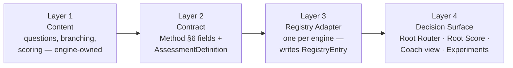

# The Focused Investigation Library — Architecture

**Prompt 5 deliverable — architecture and specification only (no code, no migrations, no
implementation)**
MEF Wellness · Governed by [The Rooted Reset Method, v2](./METHODOLOGY.md),
[the Foundational Investigation architecture](./FOUNDATIONAL-INVESTIGATION.md), and
[its content spec](./FOUNDATIONAL-INVESTIGATION-CONTENT.md)
Status: **draft, pending approval before Prompt 6**

---

## 0. How to read this document

This document does not design one investigation (that was Prompts 3–4). It defines how **every**
future Focused Investigation gets built, categorized, unlocked, branched, scored for confidence,
written into the Root Model, reassessed, customized by coaches, versioned, and connected to the
Root Router, Lifestyle Experiments, and Root Score — the governing library architecture the Method
promised in §6 ("every Focused Investigation... declares the same four things") and Recommendation
3 ("explicitly resolve whether the platform's several existing assessment engines get unified,
extended, or left as-is").

**Two things surfaced by this document's research change how the rest of it should be read:**

**First — a terminology collision.** Several already-shipped files in this codebase (`lib/
assessment-registry/findingRecommendations.ts`, `lib/registry/trendStatus.ts`) carry comments
referencing their **own**, already-completed "Prompt 6" — the *Universal Assessment Intelligence
Engine*'s build sequence, unrelated to this Method's Prompt numbering. Wherever this document cites
that work, it's called **"the Assessment Intelligence Engine's Prompt 6"** — never bare "Prompt 6"
— so it's never confused with whatever this Method's own Prompt 6 turns out to be.

**Second — the Root Model already exists.** Method Recommendation 5 assumed the platform's
registry/health-profile store "today only ingests Body Assessment and coach-intelligence data."
That's out of date. The **Universal Health Registry** (`registry_entries`, migration
`00000000000040`) already has **nine real producers**, three of which
(`lib/registry/adapters/onboarding.ts`, `questionnaireEngine.ts`, `primalPattern.ts`) already turn
assessment results into normalized, domain-coded, superseding findings — for the Onboarding
Assessment, the Nutrition & Lifestyle Questionnaire, Four Doctors Assessment, and Primal Pattern
Diet Type. **This document treats the Universal Health Registry as the Root Model's real storage
substrate**, not a new system to design. Nothing here proposes a parallel store.

**What this document builds on**, concretely:

| System | What it gives this architecture |
|---|---|
| `lib/assessment-registry/{registry,types}.ts` | The real `AssessmentDefinition` contract every live instrument already satisfies — membership, program, prerequisites, relationships, coach rules, retake/reassessment/comparison rules, versioning, safety category. |
| `lib/assessment-registry/access.ts`, `status.ts`, `facts.ts` | Real, live, server-enforced eligibility and status calculation. |
| `lib/assessment-registry/recommendation.ts` (`pickRecommendation`) | A real, live "what's next" service — status/eligibility-driven, deliberately not health-pattern-based. |
| `lib/assessment-registry/findingRecommendations.ts` | A real, live, health-*pattern*-based "what else might help" service, keyed off Universal Registry findings. |
| `lib/registry/` (`registry_entries`, `RegistryEntry`, adapters, `trendStatus.ts`) | The Root Model's real substrate — findings, severity, confidence, supersession, and trend (the Method's "Pattern," already computed). |
| `root_score_snapshots`, `lib/scoring/config.ts` | Root Score's real domain weights, confidence thresholds, and anti-gaming rules. |
| `reassessment_schedules` (migration `00000000000072`) | A real, live, currently-empty table `pickRecommendation()` already reads from — the consumer exists, the producer (a scheduler) doesn't yet. |
| Coaching Safety system (`safety_classifications`, Coach Review Queue, `lib/intelligence/safety.ts`) | The one real escalation path every safety-relevant finding, from any investigation, routes through. |

---

## 1. The complete Focused Investigation architecture

Every Focused Investigation is four layers, each already precedented by at least one live
instrument:

- **Layer 1 — Content.** The instrument itself: question set, branching, scoring formula. Stays
  "config in code," engine-owned, exactly as every live instrument already does it
  (`lib/assessments/`, `lib/primal-pattern/`, `lib/body-assessment/`). This document never
  prescribes question text — that's each investigation's own design pass, the same relationship
  Prompt 3 had to Prompt 4 for the Foundational Investigation.
- **Layer 2 — Contract.** Two contracts, both mandatory, reconciled here for the first time:
  Method §6's four coaching fields (domain mapping, unlock triggers, reassessment cadence, Root
  Model contribution shape) *are the coaching-layer subset* of the richer, already-real
  `AssessmentDefinition` type. An investigation isn't done being specified until both are filled
  in — §4 gives the full checklist.
- **Layer 3 — Registry adapter.** One `lib/registry/adapters/<engine>.ts`-shaped module per
  investigation (or shared per engine family, as `questionnaireEngine.ts` already is for two
  instruments) translating Layer 1's raw result into a `RegistryEntryDraft` write. This is the
  literal mechanism behind Method §6's "Root Model contribution" field — already built, three times
  over, just not yet named this in the Method's own language.
- **Layer 4 — Decision surface.** Where the write actually matters: whether the Root Router (§14)
  surfaces this investigation next, whether it changes another investigation's priority (§13),
  whether it seeds a Lifestyle Experiment (§15), and — only ever indirectly (§16) — whether it
  shows up in Root Score.

---

## 2. Categories of investigations

Grounded in the real `category` values already in the registry, generalized into a stable taxonomy:

| Category | Purpose | Live/planned examples |
|---|---|---|
| **Core** | Universal — every member takes it (Method §6). Not part of this library; governed by Prompts 3–4. | Foundational Investigation, Whole-Person Check-in |
| **Focused — Multi-Domain Screener** | Broad, several Coaching Domains at once, moderate depth per domain. | Short Health Assessment Questionnaire (9 categories), Four Doctors Assessment (4 categories) |
| **Focused — Single-Domain Deep Dive** | One Coaching Domain, real depth. | Nutrition & Lifestyle Questionnaire (`nutrition_lifestyle`) |
| **Focused — Classification** | Sorts the member into a type/pattern; not severity-scored. | Primal Pattern Diet Type |
| **Focused — Media Capture & Review** | Camera/sensor capture, coach-reviewed, not question/answer. | Body Assessment |
| **Focused — Behavioral / Readiness** | Stage-of-change, motivation, self-report — feeds Capacity more than a single Coaching Domain. | Readiness to Change *(coming soon)* |

---

## 3. Investigation templates

Reusable shapes, matching the real `AssessmentType` union plus real scoring-adapter precedent —
every new Focused Investigation should be an instance of one of these, not a bespoke one-off:

| Template | Shape | Scoring adapter (real) | When to choose it |
|---|---|---|---|
| **A — Points-Scored Questionnaire** | Category-banded scoring against fixed point ranges | `generic-questionnaire-engine` | Symptom-frequency or lifestyle-pattern domains with a clear moderate/significant band — most of the twelve Coaching Domains. |
| **B — Classification Questionnaire** | Rule-based sort into a type, not a severity score | `primal-pattern-engine` | Domains where the useful output is "which pattern are you," not "how bad is it." |
| **C — Media Capture & Review** | Guided capture, geometric/AI screening, human coach review | `body-assessment-geometric-screening` | Physical/structural domains where self-report alone is unreliable. |
| **D — Intake / Comparator** | Raw stored answers, no score, baseline-vs-reassessment diff | `onboarding-comparator` | Breadth-first or narrative-leaning domains — this is the Foundational Investigation's own template. |
| **E — Behavioral / Readiness Reflection** | Short, non-scored, stage-of-change style | *(none live yet — Readiness to Change is Coming Soon)* | Capacity and motivation reads that shouldn't be scored like a symptom checklist. |

**For the four Coaching Domains with zero instrumentation today** (Identity & Self-Concept,
Purpose & Motivation, Relationships & Social Connection, Environment & Daily Rhythm — Method
Recommendation 2), **Template D or E is the right starting point, not Template A.** These are
self-concept and narrative-leaning domains; scoring them like a symptom checklist would misrepresent
what they're actually measuring, and would contradict Method v2 §1's "note on stance" (working
hypotheses, not verdicts).

---

## 4. Required components every investigation must contain

Every Focused Investigation — before it can be considered specified, regardless of which template
it uses — must declare all of the following:

1. **Coaching Domain mapping** (Method §6, field 1) — which of the twelve it primarily informs.
2. **Unlock trigger** (Method §6, field 2) — the Root Router condition that surfaces it (§11, §14).
3. **Reassessment cadence** (Method §6, field 3) — see §8.
4. **Root Model contribution shape** (Method §6, field 4) — which `RegistryDomain`/code(s), what
   severity bands map to what confidence (§6, §7).
5. **A complete `AssessmentDefinition` registry entry** — membership, program, prerequisites,
   `relatedAssessmentKeys`, `clinicalPriority`, coach rules, retake rules, comparison rules, result
   access — the same fields every live instrument already has.
6. **A Registry adapter module**, following the `RegistryEntryDraft` contract exactly (§7).
7. **A `safetyCategory`** and, if not `none`, an explicit escalation mapping (§12).
8. **Versioning fields** — `currentVersion`, `versionLockingRequired` (§17).
9. **Member-facing copy references only** (`introCopyRef`, `componentRef`) — never an internal
   questionnaire id or engineering name in anything member-visible, per the registry's own
   established rule.
10. **`displayOrder` and `category`** (§2).

---

## 5. Branching logic standards

Generalizing the Foundational Investigation's one real branch (Prompt 4 §3) into a library-wide
standard:

- **Branch only on severity or genuine ambiguity — never for its own sake.** Every branch must be
  able to state, in one sentence, what uncertainty it resolves that its parent item didn't (Method
  principle 5's test, applied at design time).
- **Cascade depth cap: three levels.** Base item → severity → duration/consent (the pain cascade's
  own shape) is the reference pattern. Focused Investigations can go deeper than the Foundational
  Investigation's near-zero branching, but an unbounded cascade defeats "earn the next question"
  (Method principle 4) just as surely as a flat 90-question form does.
- **Free text is never a branch point.** Every free-text response, in any investigation, is routed
  through the platform's existing safety classification pipeline as a blanket rule — never
  inline-branched into a follow-up question. This is the same deliberate choice Prompt 4 §10 made
  for the Foundational Investigation, generalized here to the whole library.
- **A branch's terminal action is always one of: raise Priority, request coach-outreach consent, or
  route to safety classification** — never a dead-end informational screen with no Root Model
  effect. If a branch wouldn't change anything downstream, it shouldn't exist (principle 5, again).

---

## 6. Confidence scoring standards

Two real, already-tuned numeric schemes exist and should be reused rather than reinvented:

- **Per-entry confidence** — `registry_entries.confidence` (0–1). `questionnaireEngine.ts`'s
  existing convention: ground it in where the raw score sits within its own severity band, never
  fabricated, within a fixed range (its own precedent: `[0.55, 0.9]` for a moderate/high-band
  finding). Every new adapter should follow the same "grounded in band position, fixed range"
  discipline, not invent a new confidence formula per investigation.
- **Numeric-to-label mapping** — reuse `CONFIDENCE_THRESHOLDS` from `lib/scoring/config.ts` (`low:
  0.25, moderate: 0.5, high: 0.75`) as the one standard mapping from a numeric confidence to the
  Method's `building`/`low`/`moderate`/`high` vocabulary, everywhere that vocabulary is shown —
  don't let Focused Investigations invent a second threshold scheme.
- **Domain-level Confidence — the Method's four-value label — is the *higher* of two things:**
  (a) the numeric-threshold-derived label of the single strongest active entry in that domain, and
  (b) a **`moderate` floor granted only when two or more *independent* investigations** (not two
  items within the same instrument) **have each written an active, corroborating entry in that
  domain.** Cross-instrument corroboration is what unlocks `moderate`/`high` — a single instrument,
  no matter how deep, caps a domain at whatever its own strongest entry earns numerically. This is
  the Focused-Investigation-tier generalization of Prompt 4 §4's Foundational-tier rule (which
  capped everything at `building`/`low` because a single light pass can never corroborate itself).

---

## 7. Root Model contribution rules

**The Root Model is the Universal Health Registry.** Every Focused Investigation contributes to it
through exactly one mechanism: a Registry adapter writing `RegistryEntryDraft` rows, following the
same contract as the three that already exist.

**The rule that already governs this, reused verbatim:** a result in the "nothing wrong to report"
band is **never registered as a new finding.** `questionnaireEngine.ts`'s own rule — "a 'low'
priority category is not a finding... and is never registered; if a prior active finding for that
category exists, it's resolved instead" — is the standard for every future adapter. Silence or
improvement resolves a prior finding; it never manufactures a new positive one.

**Pattern is already built.** The Method's "Pattern" (v2 §2 — a Signal that recurs or clusters
meaningfully) is operationalized today as `trend_status`
(`new`/`improving`/`stable`/`worsening`/`resolved`), computed deterministically by
`lib/registry/trendStatus.ts`'s `computeFindingTrendStatus`. Every adapter calls this same function
— no investigation computes its own trend logic.

**Domain vocabulary reconciliation.** Four distinct domain vocabularies coexist in this codebase
today, and every Focused Investigation must be legible in all four without collapsing them into
one:

| Vocabulary | Values | Owner | Used for |
|---|---|---|---|
| Onboarding's 5 clusters | `sleep`, `mind_stress`, `movement_energy`, `nutrition_digestion`, `pain_structural` | `lib/onboarding/baseline.ts` `DOMAIN_ORDER` | The stored `domain` column on `onboarding_questions` (kept, per Method Recommendation 1). |
| Method's 12 Coaching Domains | See Method v2 §5 | This document series | The coaching-layer taxonomy — app-layer only, never a stored enum. |
| `RegistryDomain` | `posture`, `movement`, `breathing`, `questionnaire`, `sleep`, `stress`, `nutrition`, `wearable`, `lab`, `hormone` | `packages/shared-types-contracts/registry.types.ts` | What every Registry adapter actually writes to `registry_entries.domain`. |
| `ScoreDomainKey` | `recovery`, `stress`, `nutrition`, `movement`, `consistency` | `lib/scoring/config.ts` `DOMAIN_WEIGHTS` | Root Score's weighted composite (§16). |

**Every Focused Investigation's Contract (§4, field 4) must state its mapping into all four** —
not just its Coaching Domain. This document does not attempt to collapse the four into one; per
Method Recommendation 1's own precedent (map many-to-one rather than expand a stored enum), that's
the right call here too — four small, explicit mapping tables per investigation are lower-risk than
one grand unified enum touching four different systems at once.

---

## 8. Reassessment rules

`reassessment_schedules` (migration `00000000000072`) is real, live, and — as of this writing —
**empty**: nothing currently writes a row into it. But `pickRecommendation()`'s
`isReassessmentDue()` already reads `facts.pendingReassessmentSchedule.dueAt` as its **second**
priority tier, right after coach assignment. **The consumer is already built; the producer (a
scheduler) is the actual gap.**

The standard going forward:

1. Every Focused Investigation declares a cadence (Method §6 field 3) — e.g., "30/90-day
   checkpoint," "member-initiated, unlimited retakes" (today's real default for four of six live
   instruments), or a finding-triggered cadence ("re-run when the domain's Priority changes").
2. On completion of an attempt, a (not-yet-built) scheduler writes a `reassessment_schedules` row —
   `anchor_attempt_id` set to that attempt, `due_at` computed from the declared cadence, `stage`
   set appropriately (mirrors Onboarding's existing `['baseline', 'reassessment']` stages).
3. Once that scheduler exists, `pickRecommendation()` needs **no changes** to start surfacing due
   reassessments for every instrument that declares a cadence — it already reads the table it would
   populate.
4. Reflection vs. Reassessment stays the Method's own distinction (§9 of the Method): a Reflection
   never populates `reassessment_schedules`; only a Core or Focused Investigation becoming due does.

---

## 9. Coach customization

Grounded in the real `CoachRules` type (`approvalRequired`, `assignmentSupported`,
`coachReviewRequired`) and the fact that `coach_assigned` is already `pickRecommendation()`'s
**highest** priority tier — an explicit human decision already wins over every algorithmic signal,
live, today.

- **Every Focused Investigation defaults to `assignmentSupported: true`.** A coach can hand-assign
  any investigation to their client regardless of what the Root Router would have picked — this is
  Method principle 9 ("coaches amplified, not replaced") already enforced in code, not just policy.
- **`coachReviewRequired: true` is reserved for Template C (Media Capture) and any
  `clinicalPriority: 'high'` instrument** — Body Assessment's existing precedent, generalized.
- **Gap, flagged honestly:** Method §7's "coach override" step (a coach pinning or deferring a
  recommendation) has no real field on `AssessmentDefinition` or `MemberAssessmentFacts` today —
  `coach_assigned` covers "assign this," but not "suppress that other recommendation for now."
  This is a genuine build gap for whenever the Root Router (§14) gets named as a real service, not
  something this document can resolve by itself.

---

## 10. Member experience

Generalizing Prompt 3/4's Foundational-tier standards to any Focused Investigation:

- Conversational tone throughout — curiosity over verdict (Method v2 §1's "note on stance"), same
  as Prompt 4 §8, regardless of how clinical the underlying content is.
- Progress shown at the section/category level, never a bare question counter — Four Doctors' four
  categories and Short HAQ's nine are exactly the kind of natural section boundaries to surface.
- A member never sees a raw per-item severity score mid-flow. Confidence and Priority are shown at
  completion, domain-by-domain, the same softened framing Prompt 4 §8 established.
- **`coachReviewRequired` instruments must set the expectation explicitly** ("your coach will
  review this before your results are ready") rather than rendering an instant automated verdict —
  Body Assessment's existing UX pattern, generalized as the standard for every future Template C
  instrument.
- Completion always states what was learned and, if applicable, why a next step was recommended —
  same "why the next investigation was selected" pattern as Prompt 4 §8, not unique to the
  Foundational Investigation.

---

## 11. Unlock logic

**Two distinct, already-real layers, both required, neither sufficient alone:**

1. **Product/membership eligibility** — `lib/assessment-registry/access.ts`'s
   `checkAssessmentAccess()`, already real and server-enforced: membership tier, program gating,
   and the standing rule that a member's own existing progress or results are *never* hidden by a
   tier change. This is purely mechanical — it answers "is this member even allowed to start this,"
   never "should they right now."
2. **Coaching relevance** — the Root Router's job (§14): is this investigation actually the right
   next thing, given what's already known. Today this is `pickRecommendation()` (status-driven) and
   `findingRecommendations.ts` (finding-driven), not yet unified.

`PrerequisiteRules.unlockRule` and `.recommendationRule` already exist on `AssessmentDefinition` as
**free-text fields with "no runtime logic implied yet"** (the type's own comment) — every live
instrument today has `null` in both. A Focused Investigation's Contract (§4) must fill these in with
real, structured triggers, not leave them as unused free text — this is the concrete gap between
"the field exists" and "unlock logic actually runs."

---

## 12. Safety escalation rules

Every investigation declares a `safetyCategory` (reuse the real enum — `none`, `clinical_intake`,
`movement_screening` — extend it, don't replace it, if a new instrument needs one, e.g. a
`symptom_severity` category for a future dedicated pain or mood instrument).

- Any item or branch capable of producing a moderate-or-worse finding in a domain with a real
  `AREA_TO_RESTRICTED_TOPICS` mapping (today: `pain`, `mood`) routes into
  `safety_classifications` / the Coach Review Queue — the exact same pipeline every existing
  investigation would use, never a per-investigation reinvention.
- Free text is always blanket-routed through the same pipeline (§5) — never a dedicated inline
  screening question.
- **No investigation in this library may embed a novel clinical screening instrument (e.g., a
  validated crisis or diagnostic tool) without a dedicated, separately-reviewed clinical/legal
  process.** This restates Prompt 4 §10's Foundational-tier decision as a library-wide standard:
  MEF Wellness is a holistic coaching platform, not a clinical one, and this architecture should
  never quietly cross that line by accretion, one investigation at a time.

---

## 13. Relationships between investigations

Two real, already-distinct relationship mechanisms, both required:

- **Static peer relationships** — `AssessmentDefinition.relatedAssessmentKeys`. Curated, product
  judgment, "you might also find useful" — not a dependency, not a fixed sequence. Every live
  instrument already has this populated.
- **Dynamic, finding-driven relationships** — `findingRecommendations.ts`'s `DOMAIN_ROUTES`: given
  a member's active, `moderate`/`significant`, member-visible findings, which *other* investigation
  would help explore what those findings are pointing at. **The `moderate`/`significant`-only gate
  is the real, reusable severity threshold** — a `mild` finding is never strong enough evidence to
  recommend a whole other investigation, and every future `DOMAIN_ROUTES` entry should hold to it.
- Every Focused Investigation's Contract (§4) must declare both: its static peer list, and — via
  its `RegistryDomain` coverage (§7) — which `DOMAIN_ROUTES` entries it participates in, as either
  the target or (once it can itself produce qualifying findings) a future source.

---

## 14. Interaction with the Root Router

**The Root Router, as one named service (Method §7, Recommendation 6), does not exist yet.** Its
responsibilities are already split across three real modules, and this fragmentation is exactly
what Recommendation 6 warned would happen again if branching logic kept accreting per feature:

| Real module | What it actually decides |
|---|---|
| `access.ts` | Can this member even start this investigation right now (eligibility). |
| `recommendation.ts` (`pickRecommendation`) | Which single investigation to surface next, by status/eligibility rank: coach-assigned → due reassessment → in-progress → required program phase → next available. |
| `findingRecommendations.ts` | Which *other* investigations a member's active findings suggest, independent of the above. |

**Recommendation, carried into §18/closing recommendations:** when the Root Router is eventually
built as Method Recommendation 6 calls for, it should **absorb or orchestrate these three in Method
§7's five-step order** (safety gate → `pickRecommendation`'s eligibility ranking →
`findingRecommendations`'s pattern-based suggestions → member agency → coach override) — not become
a fourth parallel system layered on top. Every Focused Investigation built to this document's
Contract (§4) automatically participates in that future Root Router without extra work, provided
it has real `DOMAIN_ROUTES` and `reassessment_schedules` entries (§8, §13).

---

## 15. Interaction with Lifestyle Experiments

Per Method §8, an Experiment is sourced from "a specific investigation finding." Concretely: the
`RegistryEntry` a Focused Investigation writes (§7) — specifically its `(domain, code)` — is what an
Experiment template should key off, the same declarative shape `DOMAIN_ROUTES` and
`CATEGORY_FINDING_MAP` already use elsewhere in this codebase. This document proposes (not builds)
a parallel `finding code → experiment template` map living alongside each adapter — no investigation
should ever hardcode "and now recommend Experiment X" inline; it stays config, same discipline as
everything else here. Method §8's own guardrail is unchanged and still binds: a domain with an
active Focused Investigation doesn't also get a new Experiment opened mid-investigation.

---

## 16. Effect on Root Score

Root Score's `DOMAIN_WEIGHTS` (`recovery` 0.25, `stress` 0.2, `nutrition` 0.2, `movement` 0.2,
`consistency` 0.15) weight a **30-day rolling composite** described, in the config file's own
words, as covering "the five domains the platform currently has legitimate longitudinal data for."
Based on that framing, Focused Investigations appear to be a **point-in-time** input, not part of
that rolling composite's daily data feed — but this document hasn't read the calculation code
itself, only its configuration, and doesn't assert this with full confidence. **Flagged for
verification before Prompt 6 makes any stronger claim.**

The design principle proposed regardless: **an investigation should never write to Root Score
directly.** It should influence Root Score only *indirectly* — by informing an Experiment or a
change in daily check-in behavior, which then feeds the rolling composite the normal way. This
isn't just a style preference: `MAX_ROOT_SCORE_DAILY_CHANGE` (6 points) is a real, structural
anti-gaming ceiling that would prevent a direct write from moving the score meaningfully in one
step even if one were attempted. An investigation earns its way into Root Score through the
behavior it produces, never by writing to it.

---

## 17. Versioning strategy

Every live instrument today reports `currentVersion: 1`, `versionLockingRequired: false` — and
`versionLockingRequired`'s own type comment admits **"no system enforces this yet."** This is real,
current technical debt across all six live instruments, not a gap unique to future ones.

The standard going forward:

- **In-place content update, same version** — for changes that don't alter scoring bands, category
  structure, or domain mapping. Migration `00000000000068`'s precedent (expanding `primary_concern`'s
  options while keeping `question_key`/`question_version` unchanged) is the reference case.
- **Version bump** — for any change to scoring thresholds, category structure, or domain mapping.
  `versionLockingRequired` should flip to `true` going forward for any instrument once it has a
  second version in the wild, so an old attempt's stored result is never silently reinterpreted
  under new scoring rules.
- **Enforcing `versionLockingRequired` for the six already-live instruments is a separate,
  pre-existing cleanup item**, not something a new Focused Investigation's design should be
  expected to retroactively fix — flagged, not solved, here.

---

## 18. Future expansion strategy

- **The four uninstrumented Coaching Domains** (Identity & Self-Concept, Purpose & Motivation,
  Relationships & Social Connection, Environment & Daily Rhythm — Method Recommendation 2) are the
  clear next candidates. Per §3, they're Template D or E domains, not Template A — scoring
  self-concept or purpose like a symptom checklist would misrepresent what's being measured.
- **"Breathing" is not a standalone investigation today.** It's a real `RegistryDomain` value and a
  Body Assessment finding code (`breathing_pattern`) and one of Four Doctors' four categories — but
  no dedicated Breathing investigation exists in the registry. If one is ever built, it already has
  a domain slot waiting in the Registry vocabulary (unlike the four brand-new domains above, which
  need everything built from scratch) — worth naming honestly here rather than assuming it already
  exists.
- Once a real Root Router service exists (§14), retro-fit the six already-live instruments'
  `relatedAssessmentKeys` and `reassessment_schedules` so legacy and new investigations are governed
  by identical rules — no instrument should be permanently exempt from this architecture just
  because it shipped before it existed.

---

## 19. Worked examples — existing MEF investigations through this architecture

Classification only — no content rewritten, per the prompt's own instruction:

| Investigation | Category (§2) | Template (§3) | Coaching Domain(s) | `RegistryDomain` (adapter) | Clinical priority | Reassessment (today) |
|---|---|---|---|---|---|---|
| Onboarding Assessment | *(Core — Foundational, out of this library's scope)* | D | all twelve (Prompt 4) | `sleep`, `stress`, `nutrition` *(via `onboarding.ts`)* | high | member-initiated, `checkpoint_label` dormant |
| Nutrition & Lifestyle Questionnaire | Single-Domain Deep Dive | A | Nutrition & Metabolic Health | `nutrition`, `stress`, `sleep` *(category-mapped, via `questionnaireEngine.ts`)* | moderate | unlimited retakes, no cooldown |
| Four Doctors Assessment | Multi-Domain Screener | A | Movement & Physical Capacity, Nutrition & Metabolic Health, Recovery & Energy Regulation | `movement`, `nutrition`, `breathing`, *(rest — no direct 1:1 `RegistryDomain`)* | moderate | unlimited retakes, no cooldown |
| Primal Pattern Diet Type | Classification | B | Nutrition & Metabolic Health | *(classification — not currently a finding producer)* | low | unlimited retakes, no cooldown |
| Body Assessment | Media Capture & Review | C | Pain & Structural Integrity | `posture`, `movement`, `breathing` *(via `bodyAssessment.ts`)* | high | implicit — most recent same-type attempt |
| Short Health Assessment Questionnaire | Multi-Domain Screener | A | Sleep & Circadian Rhythm, Stress & Nervous System Regulation, Recovery & Energy Regulation, Digestion & Gut Health, and 5 more categories | *(not yet a Registry adapter — a real gap, see closing recommendations)* | moderate | unlimited retakes, no cooldown |
| Readiness to Change *(coming soon)* | Behavioral / Readiness | E | Capacity (cross-domain, not a Coaching Domain) | *(none — no content yet)* | low | n/a |

---

## Recommendations before Prompt 6

1. **Build the reassessment scheduler (§8).** `pickRecommendation()` already reads a table nothing
   writes to — this is the single highest-leverage, most concretely-scoped gap this document found.
2. **Decide who owns naming the Root Router as one real service (§14)**, and whether it absorbs
   `pickRecommendation()` + `findingRecommendations.ts` or orchestrates them — this is Method
   Recommendation 6, now demonstrated with real file names instead of a general warning.
3. **Give the Short Health Assessment Questionnaire a Registry adapter.** It's the broadest live
   instrument (9 categories) and currently the only points-scored questionnaire *without* one — a
   real, scoped gap, not a hypothetical future one.
4. **Model coach pin/defer** (§9) as a real field somewhere — Method §7's coach-override step has
   no home in the current schema.
5. **Verify the Root Score relationship (§16)** with whoever owns the actual calculation code
   before treating this document's "indirect only" principle as confirmed rather than proposed.
6. **Schedule the `versionLockingRequired` enforcement pass (§17)** as its own item — it's real
   debt across all six live instruments today, independent of anything new this document proposes.
7. **Assign Template D or E (§3, §18) to the four uninstrumented Coaching Domains** before any of
   them gets a real content-design prompt of their own.

---

*End of Prompt 5 deliverable. Awaiting approval before Prompt 6.*
