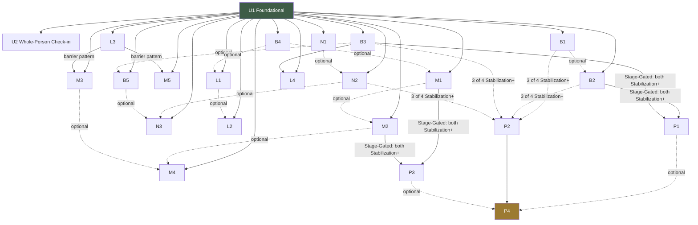
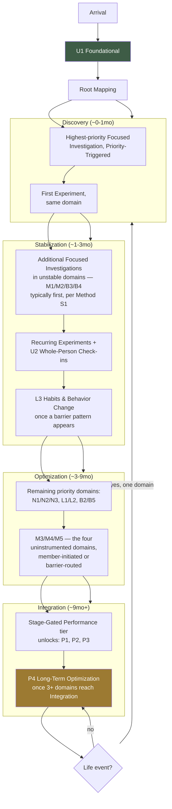

# The Complete Rooted Reset Investigation Library

**Prompt 8 deliverable — master blueprint, no questions written, no code, no schema**
MEF Wellness · Governed by [The Rooted Reset Method, v2](./METHODOLOGY.md),
[the Focused Investigation Library architecture](./FOCUSED-INVESTIGATION-LIBRARY.md),
[the Root Model and Router](./ROOT-MODEL-AND-ROUTER.md),
[the Coaching Content Framework](./COACHING-CONTENT-FRAMEWORK.md)
Status: **draft, pending approval before any individual investigation is written**

---

## 0. How to read this document

Prompts 1–7 defined the rules: what an investigation *is* (Method §6), how it's built, categorized,
scored, and unlocked (Focused Investigation Library), how the Root Model and Root Router actually
reason over it (Root Model & Router), and how it's written (Content Framework). None of those
documents named the actual set of investigations that will exist. This document does — the
complete roster, every investigation's place in the member journey, and how they connect to each
other, so that when individual investigations are designed one at a time in future prompts, each
one is filling a pre-scoped slot in a coherent whole rather than being invented in isolation.

**This document does not modify any prior architecture document.** It is a content-planning layer
on top of them. Every field below is a direct instance of the contract those documents already
established:

| This document's field | Where it's governed |
|---|---|
| Investigation name, Coaching domain(s) | Method §5, §6 field 1 |
| Root Router conditions that unlock it | Method §7; Library §11, §14 |
| Required / Optional previous investigations | Library §4 (Contract), §13 (relationships) |
| Confidence increased, Root Model fields updated | Method §6 field 4; Library §6, §7; Root Model §3 |
| Possible Root Router outcomes | Root Model §7, §8 |
| Recommended Lifestyle Experiments | Method §8; Library §15 |
| Recommended reassessment schedule | Method §6 field 3, §9; Library §8 |
| Unlocks next | Library §13, §14 |

**Six live/named instruments already exist** (Body Assessment, Nutrition & Lifestyle
Questionnaire, Four Doctors Assessment, Primal Pattern Diet Type, Short Health Assessment
Questionnaire, and the Onboarding Assessment evolving into the Foundational Investigation) plus one
already flagged as coming soon (Readiness to Change, Library §2/§19). **This document does not
invent competing instruments for those slots.** Where a designed investigation below occupies a
slot a real instrument already fills, that's stated explicitly, and the real instrument is treated
as the canonical occupant of that slot going forward, per Library §18's "no instrument should be
permanently exempt from this architecture."

---

## 1. Library-wide conventions

### 1.1 Category legend (Library §2, extended)

| Code | Category | Notes |
|---|---|---|
| **Core** | Universal, every member | Not part of the Focused library proper; governed by Prompts 3–4. |
| **MDS** | Multi-Domain Screener | Broad, several domains, moderate depth each. |
| **SDD** | Single-Domain Deep Dive | One Coaching Domain, real depth. |
| **CLS** | Classification | Sorts into a type/pattern, not severity-scored. |
| **MCR** | Media Capture & Review | Camera/sensor, coach-reviewed. |
| **B/R** | Behavioral / Readiness | Stage-of-change, motivation, feeds Capacity. |
| **ASY** | Advanced Synthesis *(new — introduced by this document)* | Cross-domain, late-stage, stage-gated rather than priority-gated; reserved for the **Performance** category (§7). Extends Library §2's taxonomy with the one category that document didn't yet need. |

### 1.2 Template legend (Library §3)

`A` Points-Scored Questionnaire · `B` Classification · `C` Media Capture & Review · `D`
Intake/Comparator · `E` Behavioral/Readiness Reflection.

### 1.3 Unlock trigger types

Every investigation's "Root Router conditions" cites one or more of these five reusable trigger
types, so the per-investigation entries below stay short instead of re-deriving Root Router logic
each time:

| Trigger type | Fires when |
|---|---|
| **Priority-Triggered** | A prior investigation (usually the Foundational Investigation) flags this investigation's Coaching Domain at Priority ≥ *worth watching*, and the domain has no Focused Investigation currently in progress. |
| **Finding-Routed** | An active, `moderate`/`significant` finding in a *different* domain routes here via a `DOMAIN_ROUTES`-style relationship (Library §13) — recommended as "what else might help," independent of this domain's own priority. |
| **Stage-Gated** | Unlocked only once specific prerequisite domain(s) reach a declared per-domain Stage (Method §10) — reserved for §7 Performance investigations. |
| **Cadence-Triggered** | This investigation's most recent completed instance has crossed its declared reassessment cadence (Library §8). |
| **Member-Initiated** | The member self-selects it directly, overriding algorithmic order (Method §7 step 4). True for every investigation in this library by default — omitted per-entry unless a product/membership gate applies. |

**Two blanket gates apply to every Focused Investigation without exception**, per Method §7 step 1,
and are not repeated per entry below: **(a)** the Foundational Investigation must be complete, and
**(b)** no two heavy Focused Investigations run back-to-back without a lighter touchpoint (a
Reflection or a completed Experiment) between them.

### 1.4 Confidence and Priority vocabulary recap

Confidence: `building` / `low` / `moderate` / `high` (Library §6). A domain crosses into
`moderate`/`high` only via a single strong entry *or* cross-instrument corroboration — never depth
within one instrument alone. Priority (member-facing, three-value): `quiet` / `worth watching` /
`needs attention now` (Method §4, reconciled in Root Model §8 against the real four-value coach
scale `priority`/`discuss`/`monitor`/`none`).

---

## 2. Universal — Core Investigations

These are not part of the Focused library's conditional-unlock logic; every member takes them.
Included here for completeness of the map only — their content is already fully specified
(Prompts 3–4) and is **not redesigned by this document.**

### U1 — Foundational Investigation
- **Coaching domain(s):** all twelve, lightly (Method §5).
- **Category / Template:** Core / D.
- **Primary objective:** Populate the member's first Root Map — breadth over depth, across every
  domain at once.
- **Why it exists:** The one mandatory instrument; without it nothing else in this library can
  unlock (the blanket safety gate, §1.3).
- **Unlock conditions:** None — first thing every member does after Arrival (Method §4, Stage 1).
- **Required / optional prior investigations:** None.
- **Hypotheses investigated:** None yet — this is the instrument that *generates* the first round
  of hypotheses for everything else to investigate.
- **Confidence increased:** Establishes `building`/`low` baseline confidence in all twelve domains
  simultaneously (Library §6 — a single light-touch pass can never itself exceed `low`).
- **Root Model fields updated:** Writes across all `RegistryDomain` values via
  `lib/registry/adapters/onboarding.ts`; populates the initial `MemberHealthProfile`.
- **Possible Root Router outcomes:** Root Mapping (Method §4, Stage 2) → Root Router recommends 1–2
  Focused Investigations (Priority-Triggered) for Stage 3.
- **Recommended Lifestyle Experiments:** None sourced directly — too early; First Experiment
  (Method §4, Stage 4) is sourced from whichever Focused Investigation follows.
- **Recommended reassessment schedule:** Member-initiated re-run; `checkpoint_label` mechanism
  (dormant, Method Recommendation 4) is the intended long-term home.
- **Commonly unlocks next:** Whichever domain(s) it flags highest-priority — see §6 (Unlock Map)
  for the full fan-out to every SDD/MDS investigation in this library.

### U2 — Whole-Person Check-in
- **Coaching domain(s):** all twelve, lightly, recurring.
- **Category / Template:** Core / D (short recurring variant).
- **Primary objective:** Keep every domain's confidence from decaying to zero between Focused
  Investigations (Method §6).
- **Why it exists:** Without it, a domain with no active Focused Investigation would go stale
  (Method principle 8) purely from inattention, not from anything actually changing.
- **Unlock conditions:** Cadence-Triggered — recency decay (Method §7 step 3) on any domain with no
  recent signal.
- **Required / optional prior investigations:** Foundational Investigation only.
- **Hypotheses investigated:** "Has anything changed since we last checked in," across all domains
  at once — a maintenance pulse, not a hypothesis test.
- **Confidence increased:** Refreshes recency on whichever domains it touches; does not itself lift
  a domain out of `building`/`low` (same light-touch ceiling as U1).
- **Root Model fields updated:** Light writes across whichever `RegistryDomain` values it samples;
  resets staleness clocks (Root Model §4).
- **Possible Root Router outcomes:** Usually "wait" (Root Model §11 diagram); occasionally surfaces
  a new Priority-Triggered unlock if something moved.
- **Recommended Lifestyle Experiments:** None directly.
- **Recommended reassessment schedule:** Frequent, lightweight — closer to Reflection cadence
  (Method §9) than a full Reassessment, despite being a Core Investigation.
- **Commonly unlocks next:** Any domain investigation whose priority moved since last checked.

---

## 3. Mind — Focused Investigations

### M1 — Stress & Nervous System Investigation
- **Coaching domain(s):** 3 (Stress & Nervous System Regulation).
- **Category / Template:** SDD / A.
- **Primary objective:** Determine whether the member's stress load and nervous-system regulation
  capacity are stable enough to support new coaching load elsewhere (Method principle 2, "regulate
  before you optimize").
- **Why it exists:** Domain 3 gates almost every other domain's pacing — the Method treats
  regulation as a load-bearing wall, not one domain among twelve. An unresolved `building`/`low`
  confidence here keeps the Root Router conservative everywhere else.
- **Unlock conditions:** Priority-Triggered (Foundational flags `mind_stress` cluster ≥ *worth
  watching*); Finding-Routed from M2, B3, B4, or N1 (stress correlates with mood, recovery, sleep,
  and digestion per the real `CORRELATION_RULES`, Root Model §6).
- **Required prior investigations:** Foundational Investigation.
- **Optional prior investigations:** Short Health Assessment Questionnaire (broad, already covers a
  stress category — useful corroborating signal before this deep dive).
- **Hypotheses investigated:** Is elevated stress acute/situational or chronic; is the member's
  regulation capacity (not just perceived stress) the actual limiting factor; does a specific
  activation/recovery imbalance pattern exist.
- **Confidence increased:** Domain 3 to `moderate`/`high` if corroborated by a Foundational flag or
  Short HAQ result (Library §6's cross-instrument boost, `min(0.9, avg + 0.1)`).
- **Root Model fields updated:** `RegistryDomain: stress` (codes e.g. `elevated_stress`,
  `chronic_stress_pattern`, `dysregulated_activation_recovery` — proposed); `WellnessMetricKey:
  stress`; `ScoreDomainKey: stress`.
- **Possible Root Router outcomes:** Unlock L3 (Habits & Behavior Change) if the finding is
  behavioral rather than acute; recommend a regulation-focused Experiment; if severity crosses the
  `mood`/restricted-topic threshold, route to safety classification (Library §12) instead.
- **Recommended Lifestyle Experiments:** *3-Breath Reset* (daily regulated-breathing practice, 2
  weeks); *Evening Wind-Down Window* (screen/stimulation curfew, 1–2 weeks); *Micro-Break Cadence*
  (scheduled midday pause, 2 weeks).
- **Recommended reassessment schedule:** 30-day checkpoint while `worsening`/`new`; 90-day once
  `stable`/`improving` (Method §9 default).
- **Commonly unlocks next:** M2 (Emotional Resilience), B4 (Sleep), L3 (Habits & Behavior Change).

### M2 — Emotional Resilience Investigation
- **Coaching domain(s):** 4 (Emotional Resilience & Mood).
- **Category / Template:** SDD / A.
- **Primary objective:** Distinguish mood patterns and emotional-regulation strategy from acute
  stress load — a related but genuinely separate domain (Method §5).
- **Why it exists:** M1 and M2 are easy to conflate; without a dedicated instrument, mood gets
  coached as a symptom of stress even when it's an independent finding with its own pattern.
- **Unlock conditions:** Priority-Triggered (Foundational `mind_stress` flag); Finding-Routed from
  M1 (stress↔mood is a real hard-coded hypothesis pair, Root Model §6 Level 2).
- **Required prior investigations:** Foundational Investigation.
- **Optional prior investigations:** M1 (Stress & Nervous System) — most useful when run after, so
  the two can be read against each other rather than in isolation.
- **Hypotheses investigated:** Is mood variability tracking stress load 1:1, or moving
  independently; what emotional-regulation strategies the member already uses and whether they're
  adaptive or avoidant.
- **Confidence increased:** Domain 4; also strengthens or weakens M1's stress↔mood hypothesis
  (Root Model §6 Level 2, `pairedDeclineHypothesis`).
- **Root Model fields updated:** `RegistryDomain: stress` *(mood has no dedicated RegistryDomain
  value today — mapped via the `mood` restricted-topic category and `stress`/`wellbeing` codes,
  proposed; flagged as a real gap to resolve before this investigation is built, same class of gap
  Method Recommendation 1 already named for the domain taxonomy)*; `WellnessMetricKey: mood`.
- **Possible Root Router outcomes:** If mood findings cross the `mood` restricted-topic threshold,
  route to safety classification (`medical_evaluation_recommended` or higher) before any Experiment
  is offered — this domain has the platform's real, live escalation path already wired for it
  (Method §7 recap in Content Framework §11).
- **Recommended Lifestyle Experiments:** *Mood-Tracking Pulse* (daily one-tap mood log, 2 weeks, to
  build the sample `LongitudinalTrend` needs); *Values-Aligned Micro-Action* (one small
  values-consistent action daily, 1–2 weeks) — sourced jointly with M4 (Purpose) where both fire.
- **Recommended reassessment schedule:** 30-day while active finding present; otherwise
  Whole-Person Check-in carries it between Focused re-runs.
- **Commonly unlocks next:** M4 (Purpose), L3 (Habits & Behavior Change), coach follow-up if
  safety-adjacent.

### M3 — Identity Investigation
- **Coaching domain(s):** 1 (Identity & Self-Concept). *Uninstrumented today — Method
  Recommendation 2.*
- **Category / Template:** SDD / **D** (Library §3: self-concept domains use Template D or E, never
  A — scoring identity like a symptom checklist would misrepresent it).
- **Primary objective:** Understand how the member sees themselves in relation to their body and
  health, and what past attempts (successful or not) shaped that self-concept.
- **Why it exists:** Method principle 7 — identity is load-bearing, not decorative. A member whose
  self-concept treats change as "something that doesn't work for people like me" needs a
  fundamentally different coaching approach than a low-confidence-but-optimistic one, regardless of
  what any other domain shows.
- **Unlock conditions:** Priority-Triggered only indirectly — Identity has no existing cluster to
  flag it from Foundational (Method §5), so its primary trigger is **Member-Initiated**, plus
  Finding-Routed when a Habits & Behavior Change (L3) result shows a self-efficacy pattern worth
  investigating deeper.
- **Required prior investigations:** Foundational Investigation.
- **Optional prior investigations:** L3 (Habits & Behavior Change) — a low-readiness finding there
  is a natural bridge into "what's the self-concept underneath this."
- **Hypotheses investigated:** Does the member's self-concept treat their body/health as changeable;
  what prior attempts (diets, programs, coaches) shaped current beliefs; is there a
  identity/behavior mismatch (e.g., "I'm not an exercise person" despite stated goals).
- **Confidence increased:** Domain 1, from zero baseline (first instrument ever to touch it).
- **Root Model fields updated:** No existing `RegistryDomain` value maps cleanly — this is a
  genuine new-vocabulary gap (same honest flag as Root Model §11's "no direct field" findings);
  proposed as a new narrative/qualitative contribution shape (Method §6 field 4's third option —
  narrative observation, not a structured metric) rather than forcing a numeric registry entry.
- **Possible Root Router outcomes:** Feeds `MemberHealthProfile`'s narrative layer
  (`lib/narrative/`) rather than triggering a structured Experiment directly; may raise or lower
  Capacity estimate, changing pacing recommendations platform-wide.
- **Recommended Lifestyle Experiments:** *Small Win Ledger* (log one thing that went as intended
  each day, 2 weeks — deliberately not outcome-scored, just noticing); *"Not a ___ Person"
  Reframe Prompt* (a single reflective prompt, not a behavior change at all — this domain's
  Experiments lean narrative).
- **Recommended reassessment schedule:** Long — 90+ days; self-concept shifts slowly and re-asking
  too often risks feeling like a test rather than a check-in.
- **Commonly unlocks next:** M4 (Purpose), L3 (Habits & Behavior Change).

### M4 — Purpose Investigation
- **Coaching domain(s):** 2 (Purpose & Motivation). *Uninstrumented today — Method Recommendation
  2.*
- **Category / Template:** SDD / D.
- **Primary objective:** Understand the member's "why" — values, and what a meaningful day/week
  looks like to them, distinct from stated goals.
- **Why it exists:** Method principle 7, same as M3. A goal ("lose 20 pounds") is not the same as
  the purpose beneath it ("be able to play with my kids without getting winded") — the Method
  coaches to the latter.
- **Unlock conditions:** Member-Initiated primarily; Finding-Routed from M2 (mood/values-consistent
  action) or L3 (low-readiness/motivation finding).
- **Required prior investigations:** Foundational Investigation.
- **Optional prior investigations:** M3 (Identity) — purpose and self-concept read naturally
  together; M2 (Emotional Resilience).
- **Hypotheses investigated:** What the member's actual "why" is, beneath any stated goal; whether
  current coaching activity is values-aligned; what a meaningful week currently looks like versus
  what the member wants it to look like.
- **Confidence increased:** Domain 2, from zero baseline.
- **Root Model fields updated:** Same genuine gap as M3 — narrative contribution to
  `lib/narrative/`, no clean `RegistryDomain` mapping; proposed, not forced.
- **Possible Root Router outcomes:** Reframes how Experiments across *every* domain get worded
  (Content Framework §9's "invitation, not prescription" leans harder on purpose-alignment once
  this exists); can surface a values/behavior mismatch worth a coach conversation.
- **Recommended Lifestyle Experiments:** *One Meaningful Thing* (name and do one purpose-aligned
  action this week, non-scored); *Why-Ladder Reflection* (a single "why does that matter to you"
  follow-up prompt, one-time, not a recurring Experiment).
- **Recommended reassessment schedule:** Long — 90+ days, same reasoning as M3.
- **Commonly unlocks next:** L3 (Habits & Behavior Change), P4 (Long-Term Optimization) once the
  member is well into Integration.

### M5 — Relationships Investigation
- **Coaching domain(s):** 11 (Relationships & Social Connection). *Uninstrumented today — Method
  Recommendation 2.*
- **Category / Template:** SDD / D.
- **Primary objective:** Understand the quality and depth of the member's social support as a real
  coaching variable, not a demographic footnote.
- **Why it exists:** Social support is one of the strongest real predictors of sustained behavior
  change in the literature this Method draws its philosophy from, yet the platform has zero
  instrumentation for it today (Method Recommendation 2) — a genuine, not hypothetical, gap.
- **Unlock conditions:** Priority-Triggered indirectly not possible (no existing cluster);
  Member-Initiated; Finding-Routed from L3 (a repeated-barrier pattern that traces to lack of
  support, per the real `repeating_barrier` `PatternKind`, Root Model §5).
- **Required prior investigations:** Foundational Investigation.
- **Optional prior investigations:** M2 (Emotional Resilience) — mood and social connection often
  co-move.
- **Hypotheses investigated:** Does the member have anyone actively supporting their health goals;
  is isolation or an unsupportive environment a repeating barrier to Experiments succeeding; is
  there a specific relationship (partner, family, coach) that could become an Experiment
  accountability structure.
- **Confidence increased:** Domain 11, from zero baseline.
- **Root Model fields updated:** Same genuine gap as M3/M4 — narrative contribution, no
  `RegistryDomain` mapping exists.
- **Possible Root Router outcomes:** If a repeating-barrier pattern (Root Model §5) already flagged
  "external/social" as a factor across multiple failed Experiments, this investigation is the
  direct, Finding-Routed response — confirming or ruling out the social-support hypothesis.
- **Recommended Lifestyle Experiments:** *Accountability Partner Pilot* (name one person, one
  check-in ritual, 2 weeks); *Social Environment Audit* (a reflective inventory, not a behavior
  change).
- **Recommended reassessment schedule:** 90-day, or Cadence-Triggered sooner if the member's living
  situation changes (a Renewal-style trigger, Method §10).
- **Commonly unlocks next:** L3 (Habits & Behavior Change) with an accountability-structured
  Experiment template.

---

## 4. Body — Focused Investigations

### B1 — Pain & Structural Integrity Investigation
- **Coaching domain(s):** 8 (Pain & Structural Integrity).
- **Category / Template:** MCR / C. **This slot is already filled by the live Body Assessment** —
  this document does not design a competing instrument, per §0.
- **Primary objective:** Camera/sensor-based structural and postural screening, coach-reviewed.
- **Why it exists:** Self-report alone is unreliable for structural findings (Library §2's own
  stated reason for Template C existing at all).
- **Unlock conditions:** Priority-Triggered (Foundational `pain_structural` flag); Finding-Routed
  from B2 (Movement Capacity) when a movement-pattern finding suggests a structural cause.
- **Required prior investigations:** Foundational Investigation.
- **Optional prior investigations:** B2 (Movement Capacity), Four Doctors Assessment.
- **Hypotheses investigated:** Governed by the live instrument's own existing content — not
  redesigned here.
- **Confidence increased:** Domain 8; feeds the real `neck_pain_forward_head` and
  `hip_instability_knee_pain` correlation rules (Root Model §6).
- **Root Model fields updated:** `RegistryDomain: posture`, `movement`, `breathing` (via
  `bodyAssessment.ts`, already real).
- **Possible Root Router outcomes:** `coachReviewRequired` is `true` for this instrument (Library
  §9) — every result routes through coach review before the member sees it, unlike most other
  investigations in this library.
- **Recommended Lifestyle Experiments:** Sourced from existing structural finding codes — unchanged
  by this document.
- **Recommended reassessment schedule:** Implicit — most recent same-type attempt (already the real
  behavior).
- **Commonly unlocks next:** B2 (Movement Capacity), L4 (Recovery Behaviors) if a load-management
  finding surfaces.

### B2 — Movement Capacity Investigation
- **Coaching domain(s):** 6 (Movement & Physical Capacity).
- **Category / Template:** SDD / A.
- **Primary objective:** Self-reported strength, mobility, and movement variety/frequency —
  distinct from B1's structural/postural screening.
- **Why it exists:** B1 answers "what does your structure/posture look like"; this answers "what
  can you actually do, and how often do you move" — two different uncertainties Method principle 5
  requires be investigated separately, not conflated into one instrument.
- **Unlock conditions:** Priority-Triggered (`movement_energy` flag); Finding-Routed from B1.
- **Required prior investigations:** Foundational Investigation.
- **Optional prior investigations:** B1 (Pain & Structural Integrity), Four Doctors Assessment.
- **Hypotheses investigated:** Is limited movement a capacity issue (can't) or a frequency issue
  (doesn't); which movement pattern (strength, mobility, endurance) is the actual limiter.
- **Confidence increased:** Domain 6; corroborates with B1 for the `moderate` cross-instrument
  floor (Library §6).
- **Root Model fields updated:** `RegistryDomain: movement`; `ScoreDomainKey: movement`;
  `WellnessMetricKey: movement`.
- **Possible Root Router outcomes:** Recommend an Experiment; unlock P1 (Physical Performance) once
  Domain 6 reaches Stabilization (Stage-Gated).
- **Recommended Lifestyle Experiments:** *Daily Movement Snack* (5-minute movement block, 2 weeks);
  *Mobility Minimum* (one mobility drill, 1–3 weeks).
- **Recommended reassessment schedule:** 30/90-day default.
- **Commonly unlocks next:** B3 (Recovery), P1 (Physical Performance, Stage-Gated).

### B3 — Recovery Investigation
- **Coaching domain(s):** 7 (Recovery & Energy Regulation).
- **Category / Template:** SDD / A.
- **Primary objective:** Physiological recovery capacity — how well the member recovers from
  training and life load, distinct from B5's energy-*allocation* question.
- **Why it exists:** "Tired" is a symptom (Method principle 1) that could mean poor recovery
  capacity, poor energy allocation (B5), or poor sleep (B4) — three genuinely different root causes
  this library deliberately separates into three instruments rather than one "energy" catch-all.
- **Unlock conditions:** Priority-Triggered (`movement_energy` flag); Finding-Routed from M1
  (stress↔recovery) or B4 (sleep↔recovery).
- **Required prior investigations:** Foundational Investigation.
- **Optional prior investigations:** M1 (Stress & Nervous System), B4 (Sleep).
- **Hypotheses investigated:** Is recovery capacity itself impaired (independent of sleep/stress),
  or is it downstream of a sleep or stress finding already known.
- **Confidence increased:** Domain 7.
- **Root Model fields updated:** `RegistryDomain: movement`/`stress` overlap (proposed dedicated
  `recovery` code); `ScoreDomainKey: recovery`; `WellnessMetricKey` — none directly (recovery is
  currently read *through* the `movement`/`stress` trend windows, a real gap worth flagging, same
  class as M2's mood gap).
- **Possible Root Router outcomes:** If the finding is downstream of M1 or B4 rather than
  independent, Root Router deprioritizes a standalone Recovery Experiment in favor of treating the
  upstream domain first — a direct application of Method principle 1.
- **Recommended Lifestyle Experiments:** *Recovery Day Protocol* (one structured low-load day per
  week, 2–3 weeks); *Post-Training Wind-Down* (a fixed 10-minute recovery routine, 2 weeks).
- **Recommended reassessment schedule:** 30/90-day default.
- **Commonly unlocks next:** L4 (Recovery Behaviors), P1 (Physical Performance, Stage-Gated).

### B4 — Sleep Investigation
- **Coaching domain(s):** 5 (Sleep & Circadian Rhythm).
- **Category / Template:** SDD / A.
- **Primary objective:** A real depth pass on sleep quality, timing, and circadian alignment beyond
  the Foundational Investigation's light touch.
- **Why it exists:** Sleep is one of Method §1's explicit "load-bearing wall" domains (regulate
  before you optimize) — it deserves a dedicated deep dive, not just a Foundational-tier flag.
- **Unlock conditions:** Priority-Triggered (`sleep` flag); Finding-Routed from M1
  (`poor_sleep_high_stress`, a real, live correlation rule, Root Model §6).
- **Required prior investigations:** Foundational Investigation.
- **Optional prior investigations:** M1 (Stress & Nervous System) — the two are the platform's
  single most real, already-implemented cross-domain correlation.
- **Hypotheses investigated:** Is the issue sleep *quality*, sleep *timing/consistency*, or
  circadian misalignment (light exposure, schedule irregularity) — three different Experiment
  families.
- **Confidence increased:** Domain 5; strengthens or weakens the real `poor_sleep_high_stress`
  correlation if M1 is also active.
- **Root Model fields updated:** `RegistryDomain: sleep`; `WellnessMetricKey: sleep`;
  `ScoreDomainKey` — none directly (sleep isn't in `DOMAIN_WEIGHTS` today, a real gap flagged
  honestly, same posture as Root Model §16's Root Score caveats).
- **Possible Root Router outcomes:** Unlock L2 (Daily Rhythm) if the issue is timing/consistency
  rather than quality; unlock L1 (Environment) if light/noise factors are implicated.
- **Recommended Lifestyle Experiments:** *Consistent Wake Time* (fixed wake time regardless of
  bedtime, 2 weeks); *Wind-Down Light Dimming* (evening light reduction, 1–2 weeks).
- **Recommended reassessment schedule:** 30-day while `worsening`/`new`; 90-day once stable.
- **Commonly unlocks next:** L1 (Environment), L2 (Daily Rhythm), M1 (Stress & Nervous System) if
  not already active.

### B5 — Energy Investigation
- **Coaching domain(s):** 7 (Recovery & Energy Regulation) — secondary link to 6 (Movement).
- **Category / Template:** SDD / A.
- **Primary objective:** Energy *availability and allocation* across the day/week — distinct from
  B3's recovery-*capacity* question.
- **Why it exists:** Same principle as B3 — "low energy" needs its own instrument because it can
  mean poor allocation (skipping meals, overcommitted schedule) as easily as poor recovery.
  Deliberately kept separate so the Root Model doesn't conflate two different root causes under one
  finding.
- **Unlock conditions:** Priority-Triggered (`movement_energy` flag); Finding-Routed from B3 or N2
  (nutrition timing affecting energy).
- **Required prior investigations:** Foundational Investigation.
- **Optional prior investigations:** B3 (Recovery), N2 (Nutrition & Metabolism).
- **Hypotheses investigated:** Is energy low at a consistent time of day (allocation/schedule
  issue) or generally depleted (capacity issue, points back to B3); does energy track meal timing
  (points to N2).
- **Confidence increased:** Domain 7 (shared with B3 — see Library §6, corroboration across two
  investigations in the same domain is exactly the intended cross-instrument boost mechanism).
- **Root Model fields updated:** Same gap as B3 — no dedicated `RegistryDomain` value; proposed
  contribution through `WellnessMetricKey: energy` (already a real value, Root Model §11).
- **Possible Root Router outcomes:** Routes to B3 if capacity-driven, N2 if allocation/timing-driven
  — this investigation's main job is disambiguating which upstream domain actually owns the finding.
- **Recommended Lifestyle Experiments:** *Energy Log* (hourly 1–5 energy rating, 1 week, to build
  the trend sample); *Meal Timing Shift* (co-designed with N2 if that's the likelier cause).
- **Recommended reassessment schedule:** 30/90-day default.
- **Commonly unlocks next:** B3 (Recovery) or N2 (Nutrition & Metabolism), whichever the
  disambiguation points to.

---

## 5. Nutrition — Focused Investigations

### N1 — Digestion & Gut Health Investigation
- **Coaching domain(s):** 10 (Digestion & Gut Health).
- **Category / Template:** SDD / A.
- **Primary objective:** GI symptoms and digestive comfort as their own domain, distinct from N2's
  broader metabolic/eating-pattern focus.
- **Why it exists:** Digestive complaints correlate with stress (a real, live rule —
  `digestive_complaints_stress`, Root Model §6) but are not reducible to it; this domain needs its
  own instrument to determine which member has which relationship.
- **Unlock conditions:** Priority-Triggered (`nutrition_digestion` flag); Finding-Routed from M1
  (stress↔digestion, the real correlation rule).
- **Required prior investigations:** Foundational Investigation.
- **Optional prior investigations:** M1 (Stress & Nervous System), N2 (Nutrition & Metabolism).
- **Hypotheses investigated:** Are digestive symptoms stress-correlated or independent; do they
  cluster around specific foods/timing (routes to N2) or specific stress periods (routes to M1).
- **Confidence increased:** Domain 10; strengthens or weakens the real
  `digestive_complaints_stress` rule if M1 is active.
- **Root Model fields updated:** `RegistryDomain: nutrition`; `WellnessMetricKey: digestion`.
- **Possible Root Router outcomes:** Routes to M1 if stress-correlated; recommends an elimination-
  style Experiment if food/timing-correlated instead.
- **Recommended Lifestyle Experiments:** *Symptom-Meal Log* (2 weeks, to establish correlation
  before any elimination); *Meal-Timing Regularity* (fixed meal windows, 2 weeks).
- **Recommended reassessment schedule:** 30/90-day default.
- **Commonly unlocks next:** N2 (Nutrition & Metabolism) or M1, per disambiguation.

### N2 — Nutrition & Metabolism Investigation
- **Coaching domain(s):** 9 (Nutrition & Metabolic Health).
- **Category / Template:** SDD / A. **This slot is already filled by the live Nutrition &
  Lifestyle Questionnaire** — not redesigned here, per §0. Primal Pattern Diet Type (CLS/B) is its
  real, existing classification-tier peer for the same domain.
- **Primary objective:** Eating patterns, macronutrient balance, and metabolic markers where
  available.
- **Why it exists:** Already established by the live instrument; retained here for map
  completeness.
- **Unlock conditions:** Priority-Triggered (`nutrition_digestion` flag); Finding-Routed from B5
  (energy↔nutrition timing) or N1 (digestion↔nutrition).
- **Required prior investigations:** Foundational Investigation.
- **Optional prior investigations:** N1 (Digestion), Primal Pattern Diet Type.
- **Hypotheses investigated:** Governed by the live instrument's existing content.
- **Confidence increased:** Domain 9.
- **Root Model fields updated:** `RegistryDomain: nutrition`, `stress`, `sleep` (category-mapped,
  via `questionnaireEngine.ts`, already real); `ScoreDomainKey: nutrition`.
- **Possible Root Router outcomes:** Unaffected by this document — real, live behavior.
- **Recommended Lifestyle Experiments:** Sourced from existing finding codes — unchanged.
- **Recommended reassessment schedule:** Unlimited retakes, no cooldown (current real default).
- **Commonly unlocks next:** N3 (Hydration), L4 (Recovery Behaviors) if a metabolic-load finding
  surfaces.

### N3 — Hydration Investigation
- **Coaching domain(s):** 9 (Nutrition & Metabolic Health), secondary link to 7 (Recovery & Energy
  Regulation).
- **Category / Template:** SDD / A (lightweight — few items).
- **Primary objective:** A focused, short pass on hydration habits — real-signaled gap: `hydration`
  is already a live `WellnessMetricKey` value and a real `RecommendationDomain` (Root Model §7, §11)
  with no dedicated investigation feeding it today.
- **Why it exists:** The Intelligence Engine already has the vocabulary and a recommendation builder
  for hydration; this investigation is the missing *producer* for a consumer that already exists —
  the same "consumer built, producer missing" shape Library §8 found for the reassessment scheduler.
- **Unlock conditions:** Priority-Triggered (`nutrition_digestion` flag, secondary trigger from a
  declining `energy` trend); Finding-Routed from B5 (Energy) or N2.
- **Required prior investigations:** Foundational Investigation.
- **Optional prior investigations:** N2 (Nutrition & Metabolism), B5 (Energy).
- **Hypotheses investigated:** Is hydration adequate and consistent; does hydration timing track
  energy dips (B5) or digestive symptoms (N1).
- **Confidence increased:** A `WellnessMetricKey: hydration` trend gets its first real producer.
- **Root Model fields updated:** `RegistryDomain: nutrition` (proposed `hydration` code);
  `WellnessMetricKey: hydration` (already real, previously unfed).
- **Possible Root Router outcomes:** Directly feeds the existing (but previously unfed)
  `hydrationRecommendation`-class builder in `intelligence-engine/recommendations.ts`.
- **Recommended Lifestyle Experiments:** *Morning Hydration Anchor* (a fixed first-hour intake
  habit, 1–2 weeks); *Hydration-Energy Log* (paired with B5's Energy Log if both are active).
- **Recommended reassessment schedule:** 90-day default — low-volatility domain, doesn't need
  frequent re-checking once stable.
- **Commonly unlocks next:** Rarely a standalone next-unlock; mostly a corroborating input to B5
  and N2's existing findings.

---

## 6. Lifestyle — Focused Investigations

### L1 — Environment Investigation
- **Coaching domain(s):** 12 (Environment & Daily Rhythm). *Uninstrumented today — Method
  Recommendation 2.*
- **Category / Template:** SDD / D.
- **Primary objective:** The member's physical/sensory environment — home and work space, light
  exposure, noise, screen exposure — as a distinct coaching variable from L2's temporal-structure
  question.
- **Why it exists:** Domain 12 in the Method (§5) bundles "Environment & Daily Rhythm" as one
  domain; this document splits it into two investigations (L1, L2) that both map to Domain 12 but
  investigate genuinely different hypotheses — physical/sensory space versus schedule/routine
  structure. This is a deliberate one-domain-to-two-investigations design, the same many-to-one
  flexibility Library §7 already establishes for the domain vocabulary generally.
- **Unlock conditions:** Member-Initiated primarily (no existing cluster to flag it); Finding-Routed
  from B4 (Sleep) when light/noise factors are implicated.
- **Required prior investigations:** Foundational Investigation.
- **Optional prior investigations:** B4 (Sleep).
- **Hypotheses investigated:** Does the member's physical environment (light, noise, clutter,
  screen presence) support or work against their stated goals; is a specific environmental factor
  (e.g., evening light exposure) plausibly driving a sleep or stress finding.
- **Confidence increased:** Domain 12 (shared slot with L2).
- **Root Model fields updated:** No `RegistryDomain` mapping exists — genuine gap, narrative
  contribution proposed (same class as M3/M4/M5).
- **Possible Root Router outcomes:** Strengthens or weakens a B4 (Sleep) or M1 (Stress) hypothesis
  if environmental factors corroborate it.
- **Recommended Lifestyle Experiments:** *Light Exposure Audit* (morning light, evening dimming, 2
  weeks); *One-Space Reset* (a single environment change — bedroom or desk — 1–2 weeks).
- **Recommended reassessment schedule:** 90-day, or Cadence-Triggered sooner on a Renewal event
  (a move, a new job).
- **Commonly unlocks next:** L2 (Daily Rhythm).

### L2 — Daily Rhythm Investigation
- **Coaching domain(s):** 12 (Environment & Daily Rhythm). *Uninstrumented today — Method
  Recommendation 2.*
- **Category / Template:** SDD / D.
- **Primary objective:** The member's temporal structure — routine consistency, time-of-day
  patterns — distinct from L1's physical/sensory focus and from B4's physiological circadian
  question.
- **Why it exists:** Same domain-split rationale as L1 (see above); "when do you do things and how
  consistently" is a genuinely different uncertainty than "what does your sleep quality look like"
  or "what's in your physical space."
- **Unlock conditions:** Member-Initiated primarily; Finding-Routed from B4 (Sleep, timing/
  consistency route) or L3 (Habits & Behavior Change, if routine instability is the barrier).
- **Required prior investigations:** Foundational Investigation.
- **Optional prior investigations:** B4 (Sleep), L1 (Environment).
- **Hypotheses investigated:** Is the member's daily schedule consistent or highly variable; does
  routine instability explain why Experiments in other domains keep stalling.
- **Confidence increased:** Domain 12 (shared slot with L1).
- **Root Model fields updated:** Same gap as L1 — narrative contribution.
- **Possible Root Router outcomes:** If a `repeating_barrier` pattern (Root Model §5) traces to
  schedule instability across multiple prior Experiments, this is the direct Finding-Routed
  response.
- **Recommended Lifestyle Experiments:** *Anchor Routine* (one fixed daily anchor point — wake,
  meal, or wind-down — 2 weeks); *Weekday/Weekend Consistency Check* (a reflective log, 1 week).
- **Recommended reassessment schedule:** 90-day default.
- **Commonly unlocks next:** L3 (Habits & Behavior Change).

### L3 — Habits & Behavior Change Investigation
- **Coaching domain(s):** Cross-domain — feeds **Capacity** (Method §2), not a single Coaching
  Domain. **This is the "Readiness to Change" instrument already named as coming soon** (Library
  §2, §19) — given its full spec here.
- **Category / Template:** B/R / E.
- **Primary objective:** Stage-of-change and behavior-change readiness — how much new coaching load
  the member can actually take on right now, independent of what any single domain's severity says.
- **Why it exists:** Method §1's "note on stance" — pacing to Capacity, not to what the data alone
  would technically support. Without a dedicated instrument, Capacity is inferred only from
  proxies (`AdherenceInfo`, `StreakInsight` — Root Model §1's own flagged gap).
- **Unlock conditions:** Priority-Triggered by *pattern*, not domain flag — fires when a
  `repeating_barrier` `PatternKind` (Root Model §5) has occurred across two or more Experiments,
  regardless of which domain they were in; also Member-Initiated.
- **Required prior investigations:** Foundational Investigation, plus at least one closed Experiment
  (Method §8) — this instrument is most meaningful once there's real adherence history to read
  against, not before any Experiment has run.
- **Optional prior investigations:** M3 (Identity), M4 (Purpose) — self-concept and motivation
  findings sharpen the read.
- **Hypotheses investigated:** Is the member in a stage of change where a new Experiment is likely
  to stick; is a specific, recurring type of barrier (logistical, motivational, social) the actual
  limiter across domains.
- **Confidence increased:** Not a domain confidence — raises or lowers the platform's Capacity
  estimate directly, which changes pacing for *every* domain's recommendations.
- **Root Model fields updated:** No `RegistryDomain` — this is the concrete build target for Root
  Model §1's flagged Capacity gap; proposed as a new first-class field once a Capacity concept is
  actually modeled, not shoehorned into `registry_entries`.
- **Possible Root Router outcomes:** Directly overrides Method §7 step 2 (Priority) — a low-Capacity
  result caps how many concurrent Experiments the Root Router will offer, even if multiple domains
  are high-priority.
- **Recommended Lifestyle Experiments:** None sourced from this instrument directly — it *shapes*
  which Experiments other domains are allowed to offer (Experiment sizing/pacing), rather than
  sourcing its own.
- **Recommended reassessment schedule:** Cadence-Triggered after every 2–3 closed Experiments, not
  a fixed calendar date — Capacity is read from behavior, not time.
- **Commonly unlocks next:** M3 (Identity), M5 (Relationships) if the barrier pattern points to
  self-concept or social factors respectively.

### L4 — Recovery Behaviors Investigation
- **Coaching domain(s):** 7 (Recovery & Energy Regulation) — the *behavioral* facet, distinct from
  B3's physiological-capacity focus.
- **Category / Template:** SDD / A.
- **Primary objective:** The member's actual recovery *practices* — rest days, active-recovery
  habits, downtime rituals — as opposed to B3's physiological recovery-capacity read.
- **Why it exists:** Two members can have identical physiological recovery capacity (B3) with
  completely different recovery *behavior*; this investigation exists to catch the case where the
  behavior, not the capacity, is the actual lever — deliberately kept separate from B3 so a strong
  B3 finding doesn't get miscoded as "nothing to do" when behavior is still the gap.
- **Unlock conditions:** Priority-Triggered only after B3 has run (this investigation's value
  depends on knowing physiological capacity first); Finding-Routed from B1 (a load-management
  finding) or N2 (a metabolic-load finding).
- **Required prior investigations:** Foundational Investigation, **B3 (Recovery Investigation)**.
- **Optional prior investigations:** B1 (Pain & Structural Integrity), N2 (Nutrition & Metabolism).
- **Hypotheses investigated:** Does the member have any structured recovery practice at all; is
  time allocated to recovery adequate given B3's capacity finding; is a specific practice (sleep
  hygiene, active recovery, rest days) the missing piece.
- **Confidence increased:** Domain 7 (third instrument feeding this domain, alongside B3 and B5 —
  strong candidate for reaching `high` confidence via corroboration, Library §6).
- **Root Model fields updated:** Same proposed `recovery` code space as B3; `ScoreDomainKey:
  recovery`.
- **Possible Root Router outcomes:** If B3 showed strong capacity but L4 shows poor practice,
  routes directly to an Experiment (behavior is the lever); if both are weak, routes to coach
  follow-up instead (a capacity problem isn't solved by a behavior Experiment alone).
- **Recommended Lifestyle Experiments:** *Scheduled Rest Day* (one protected low-load day, 2–3
  weeks); *Active Recovery Menu* (pick one low-intensity activity, 2 weeks).
- **Recommended reassessment schedule:** 30/90-day default.
- **Commonly unlocks next:** P1 (Physical Performance, Stage-Gated) once this and B3 both reach
  Stabilization.

---

## 7. Performance — Advanced Synthesis Investigations

**New category (§1.1, code `ASY`), introduced by this document.** Every investigation in this
section is **Stage-Gated** (§1.3), not Priority-Triggered — none of them fire from a raw domain
flag. They exist for members who have already stabilized the domains they depend on (Method §10's
Optimization/Integration stages) and are the least precedented section of this library: no existing
live instrument occupies any of these four slots today, unlike every other category above. This
section should be read as directional, not final — see §9 (Future Expansion) for the recommended
piloting approach.

### P1 — Physical Performance Investigation
- **Coaching domain(s):** 6 (Movement & Physical Capacity) + 7 (Recovery & Energy Regulation),
  advanced tier.
- **Category / Template:** ASY / A.
- **Primary objective:** For a member who has stabilized baseline movement and recovery, investigate
  genuine performance capacity — not "is anything wrong" but "what's the next real ceiling."
- **Why it exists:** Method §10's Integration stage shifts coaching from corrective to generative
  questions. A member with no remaining movement/recovery findings still has a legitimate next
  question ("what's my next level"); this instrument is that question's home rather than
  overloading B2/B3 with a tier of depth most members never need.
- **Unlock conditions:** Stage-Gated — B2 (Movement Capacity) **and** B3 (Recovery) both at
  Stabilization or later (Method §10).
- **Required prior investigations:** B2 (Movement Capacity), B3 (Recovery), both at Stabilization+.
- **Optional prior investigations:** L4 (Recovery Behaviors), Four Doctors Assessment.
- **Hypotheses investigated:** What is the member's actual current performance ceiling; which
  specific capacity (strength, power, endurance, mobility) is the next limiting factor now that
  baseline issues are resolved.
- **Confidence increased:** Domains 6 and 7, at an advanced tier the base instruments don't reach.
- **Root Model fields updated:** `RegistryDomain: movement`; `ScoreDomainKey: movement`, `recovery`.
- **Possible Root Router outcomes:** Generative Experiment recommendation (Method §10's tone shift —
  "what would make this even better," not "what's still wrong").
- **Recommended Lifestyle Experiments:** *Progressive Load Test* (structured, coach-reviewed, 2–4
  weeks); *Performance Benchmark Reflection* (a periodic self-test, non-clinical).
- **Recommended reassessment schedule:** 90-day, generative cadence — less urgency than a
  corrective-stage instrument.
- **Commonly unlocks next:** P3 (Resilience) if the member is also stable in Mind domains; P4
  (Long-Term Optimization) once multiple Performance-tier investigations are complete.

### P2 — Healthy Aging Investigation
- **Coaching domain(s):** Cross-domain synthesis — 6, 7, 8, 9, and 1 (Movement, Recovery, Pain,
  Nutrition, Identity).
- **Category / Template:** ASY / A (Multi-Domain Screener shape, generalized to a late-stage
  synthesis rather than an early broad pass — structurally similar to Four Doctors Assessment,
  which is a natural optional prior/peer for this slot).
- **Primary objective:** A longitudinal, cross-domain read on healthspan-relevant patterns — how the
  member's stabilized domains are trending together over a longer horizon than any single-domain
  investigation captures.
- **Why it exists:** No existing instrument synthesizes *across* domains at a late-journey stage;
  everything today is single-domain deep or early-journey broad. This is the library's one
  deliberately long-horizon, multi-domain read.
- **Unlock conditions:** Stage-Gated — at least three of {B1, B2, B3, N2} at Stabilization or later,
  **and** member has been on the platform 6+ months (a real longitudinal-data floor, not just a
  stage label).
- **Required prior investigations:** At least three of B1, B2, B3, N2 at Stabilization+.
- **Optional prior investigations:** M3 (Identity), Four Doctors Assessment.
- **Hypotheses investigated:** Are the member's stabilized domains trending together (compounding
  benefit) or independently (isolated wins that aren't reinforcing each other); is there an
  emerging cross-domain pattern only visible at this longer horizon.
- **Confidence increased:** Contributes to `PatternInsight`'s longer-horizon kinds
  (`consistency_improvement`, cross-domain `domain_relationship`) rather than any single domain.
- **Root Model fields updated:** Spans multiple `RegistryDomain` values; primarily a
  `PatternInsight`/`RootCauseHypothesis`-level contribution (Root Model §5, §6) rather than a new
  finding in one domain.
- **Possible Root Router outcomes:** Surfaces a synthesized, generative recommendation spanning
  domains — closest real analog is `buildRootCauseSignalsView`'s coach-facing synthesis (Root Model
  §17), proposed here as a member-facing generative equivalent.
- **Recommended Lifestyle Experiments:** *Compounding Habit Stack* (link two already-stable
  behaviors from different domains, 4 weeks — the one Experiment type in this library explicitly
  spanning two domains at once, a deliberate exception to Method §8's "one domain" default,
  justified by this investigation's own cross-domain purpose).
- **Recommended reassessment schedule:** 6-month cadence — the longest in this library, matching
  its longitudinal purpose.
- **Commonly unlocks next:** P4 (Long-Term Optimization).

### P3 — Resilience Investigation
- **Coaching domain(s):** 3 (Stress & Nervous System) + 4 (Emotional Resilience), advanced tier.
- **Category / Template:** ASY / A.
- **Primary objective:** For a member stable in both Mind domains, investigate resilience under
  *new* load — how well regulation holds up when something changes, not just how it looks at rest.
- **Why it exists:** M1 and M2 answer "what's the current state"; a member who has stabilized both
  has a legitimate next question this library didn't otherwise have a home for — "how robust is
  this, really" — Method §10's Integration-stage generative reframing, applied to Mind specifically.
- **Unlock conditions:** Stage-Gated — M1 **and** M2 both at Stabilization or later.
- **Required prior investigations:** M1 (Stress & Nervous System), M2 (Emotional Resilience), both
  at Stabilization+.
- **Optional prior investigations:** M4 (Purpose), L3 (Habits & Behavior Change).
- **Hypotheses investigated:** Does regulation hold under a real stressor (not hypothetical); is
  the member's stability durable or dependent on current low-load circumstances.
- **Confidence increased:** Domains 3 and 4, at an advanced/durability tier.
- **Root Model fields updated:** `RegistryDomain: stress`; feeds `burnout_signal` `PatternKind`
  detection in reverse (confirming its *absence* under load, not just its presence).
- **Possible Root Router outcomes:** A strong result here is itself evidence the member's Capacity
  (L3) has genuinely grown, not just that current load happens to be light — feeds back into L3's
  Capacity estimate.
- **Recommended Lifestyle Experiments:** *Deliberate Stressor Reflection* (notice and log response
  to one real, naturally-occurring stressor, 2 weeks — not an artificially induced one); *Recovery
  Speed Check* (how quickly regulation returns to baseline after a disruption).
- **Recommended reassessment schedule:** 90-day, or Cadence-Triggered after any Renewal-type life
  event (Method §10) — resilience is exactly the domain a life event should re-test.
- **Commonly unlocks next:** P4 (Long-Term Optimization).

### P4 — Long-Term Optimization Investigation
- **Coaching domain(s):** Cross-domain capstone — no fixed set; scoped dynamically to whichever
  domains the member has reached Integration in.
- **Category / Template:** ASY / **E** (generative, narrative — Method §10's Integration-stage tone
  shift taken to its logical endpoint, not a scored instrument).
- **Primary objective:** "What's still uncertain that's worth understanding" (Method §10's own
  generative reframing of the Root Router's core question), asked directly of a member who has
  largely graduated from corrective coaching.
- **Why it exists:** This is the library's literal answer to Method §1's fourth conviction —
  curiosity as the method, not just a step. Without a dedicated instrument, a member who has
  stabilized most domains has nowhere left in the library that isn't corrective in tone, which
  would contradict Method §10 outright.
- **Unlock conditions:** Stage-Gated — member has reached Integration stage in **at least three**
  domains (any three, not a fixed set).
- **Required prior investigations:** None named specifically — the *gate* is the stage condition
  above, not any single prior investigation.
- **Optional prior investigations:** P1, P2, P3 — whichever the member has already done.
- **Hypotheses investigated:** None in the corrective sense — this instrument's own "hypothesis" is
  Method §10's generative question itself: what would make an already-stable domain even better;
  what is the member newly curious about now that urgency is gone.
- **Confidence increased:** None directly — this investigation's contribution is narrative/relational
  (deepening the coach-member relationship and the Root Model's qualitative narrative layer), not a
  confidence number.
- **Root Model fields updated:** `lib/narrative/` narrative layer only; explicitly does not write a
  new `registry_entries` finding (consistent with Method §7's own point that "deliberately waiting"
  or a Reflection are equally valid Root Router outputs to a scored investigation).
- **Possible Root Router outcomes:** Most commonly "wait" or a Reflection prompt (Root Model §11
  diagram) rather than unlocking another investigation — this is the library's one instrument whose
  most common outcome is *not* triggering more investigation, by design.
- **Recommended Lifestyle Experiments:** *Curiosity Prompt* (member-authored, not system-templated
  — the one Experiment slot in this library where the member, not a finding code, originates the
  hypothesis, matching this investigation's generative purpose).
- **Recommended reassessment schedule:** Open-ended / member-paced — no due date, consistent with
  Method §10's Integration/Renewal framing (a life event re-triggers a single domain, not this
  instrument on a schedule).
- **Commonly unlocks next:** Nothing predictable by design — may loop back to any domain if the
  member expresses new curiosity there (member agency, Method §7 step 4, at its purest expression
  in this library).

---

## 8. Investigation Dependency Map



**Solid arrows = required prior. Dotted arrows = optional prior / corroborating input.** Every
Focused Investigation not shown with an explicit incoming solid arrow still requires U1 (the
blanket gate, §1.3) — omitted from the diagram per node to keep it legible.

---

## 9. Unlock Map

Grouped by trigger type (§1.3), since that's the actual mechanism the Root Router uses, not the
category taxonomy:

| Trigger type | Investigations it governs |
|---|---|
| **Priority-Triggered** (Foundational cluster flag) | M1, M2, B2, B3, B4, B5, N1, N2, N3 — everything with a real existing Onboarding cluster to flag it from. |
| **Finding-Routed** (cross-domain correlation/pattern) | M1↔M2, M1↔B4, M1↔N1, B1↔B2, B3↔B5, N2↔N3, L3→M3/M5 (barrier pattern), B4→L1/L2. |
| **Member-Initiated only** (no existing cluster) | M3, M4, M5, L1, L2 — the four Method Recommendation 2 domains, plus L2's split from L1. |
| **Stage-Gated** (Performance tier) | P1 (B2+B3 Stabilization+), P2 (3-of-4 Stabilization+, 6mo+ tenure), P3 (M1+M2 Stabilization+), P4 (3 domains Integration+). |
| **Cadence-Triggered** (reassessment due) | Every investigation in the library, per its own declared cadence (§2–§7) — this trigger applies universally and is not repeated in the rows above. |

```mermaid
flowchart LR
    subgraph Trig1["Priority-Triggered"]
      direction TB
      T1a[Foundational flags\ndomain >= worth watching]
    end
    subgraph Trig2["Finding-Routed"]
      direction TB
      T2a[Active moderate+/significant\nfinding, DOMAIN_ROUTES match]
    end
    subgraph Trig3["Member-Initiated"]
      direction TB
      T3a[No cluster exists;\nmember self-selects]
    end
    subgraph Trig4["Stage-Gated"]
      direction TB
      T4a[Prerequisite domain(s)\nreach declared Stage]
    end
    subgraph Trig5["Cadence-Triggered"]
      direction TB
      T5a[Prior instance\npast due_at]
    end

    T1a --> RR{Root Router}
    T2a --> RR
    T3a --> RR
    T4a --> RR
    T5a --> RR
    RR -->|safety gate clear| Out[Investigation surfaced]
    RR -->|blocked| Wait[Wait / lighter touchpoint first]

    style RR fill:#3E5C46,color:#fff
```

---

## 10. Coaching Journey Map



**Reading the map:** stage is still tracked per domain, never globally (Method §10) — this diagram
shows the *typical* aggregate ordering a member experiences, not a hard sequence the Root Router
enforces. A member can be in Integration for Sleep (B4) while still in Discovery for Relationships
(M5) at the same calendar time; the Performance tier (§7) only gates on the *specific* domains it
depends on, never on a member's overall journey stage.

---

## 11. Root Router Decision Examples

Worked scenarios, matching the shape of Root Model §17's real example — each shows the Router
reasoning through "what are we trying to understand next," not just picking the top of a queue.

**Example 1 — early member, two candidates tie on priority.**
A member completes U1. Foundational flags both `mind_stress` and `sleep` at *worth watching*, with
near-identical severity. Naively, Priority alone (Method §7 step 2) doesn't break the tie. The
Router applies Recency: both are equally fresh, so that doesn't decide it either. It falls to the
real, live correlation precedent — `poor_sleep_high_stress` (Root Model §6) — and picks **M1
(Stress & Nervous System)** first, not because stress outranks sleep in the abstract, but because
Method principle 2 ("regulate before you optimize") treats nervous-system regulation as the more
load-bearing of the two load-bearing walls when forced to sequence them. B4 (Sleep) is logged as
"would have recommended" per Method §7 step 4's honesty requirement, and becomes the very next
Finding-Routed unlock once M1 closes.

**Example 2 — a finding routes across categories, not just within one.**
A member's B1 (Pain & Structural Integrity) result includes a `moderate` finding on hip
asymmetry, plausibly load-related. Rather than only recommending more Body-category investigation,
`findingRecommendations.ts`'s real `DOMAIN_ROUTES` logic (Library §13) also considers whether an
Experiment or a different domain would reduce more uncertainty. Because the member's recent
Experiment history shows two prior movement-domain Experiments both closed `didn't work`, the
Router recognizes a `repeating_barrier` pattern (Root Model §5) and, instead of recommending a
third Body Experiment, unlocks **L3 (Habits & Behavior Change)** — the barrier may not be
structural at all.

**Example 3 — safety gate overrides everything else.**
A member's M2 (Emotional Resilience) free-text response is routed through the safety classification
pipeline (Library §5, §12) and crosses the `mood` restricted-topic threshold. Regardless of what
Priority, Recency, or any Finding-Routed logic would otherwise recommend, Method §7 step 1's safety
gate fires first: the member sees calm, coach-review-required language (Content Framework §11), no
new investigation or Experiment is offered in the interim, and `CoachAlertDraft` persists into
`intelligence_coach_alerts`. The Router's own "what are we trying to understand next" question is,
for this member, temporarily suspended in favor of a human answering it directly.

**Example 4 — Stage-Gated tier correctly declines to fire early.**
A member has a strong, `high`-confidence B2 (Movement Capacity) result, but B3 (Recovery) is still
`building`. Even though B2 alone might look "ready" for advanced content, P1 (Physical Performance)
requires **both** B2 and B3 at Stabilization+ (§7) — the Stage-Gate is a conjunction, not the
higher of the two. The Router instead surfaces B3 as the next Priority-Triggered unlock, correctly
reading the member's actual state as "one wall solid, one still settling," not "ready for advanced
content."

---

## 12. Recommended Implementation Order

**Phase 1 — close the four real, named gaps (Method Recommendation 2), plus the already-flagged
Readiness instrument.**
M3 (Identity), M4 (Purpose), M5 (Relationships), L1 (Environment) — the domains with zero existing
instrumentation anywhere in the platform — plus **L3 (Habits & Behavior Change)**, since it's
already publicly flagged "coming soon" (Library §2/§19) and several other Phase 2/3 investigations'
unlock logic depends on its `repeating_barrier` routing. This phase delivers the highest new-ground
value and the fewest engine dependencies (all Template D/E — narrative, no new scoring engine
required).

**Phase 2 — round out Mind and Body single-domain depth.**
M1 (Stress & Nervous System), M2 (Emotional Resilience), B2 (Movement Capacity), B3 (Recovery), B4
(Sleep), B5 (Energy), L2 (Daily Rhythm), L4 (Recovery Behaviors — depends on B3 shipping first
within this phase). These are all Template A, reusing the already-proven points-scored questionnaire
engine — lower engineering risk than Phase 1's narrative template, sequenced second because their
unlock logic leans more heavily on Foundational's existing five clusters, which are already real.

**Phase 3 — Nutrition depth.**
N1 (Digestion & Gut Health), N3 (Hydration) — N2 already exists live. Sequenced third because both
depend on N2 as an optional prior for their strongest disambiguation logic (§5's B5↔N2 and
N1↔N2 relationships), and N3 in particular is only valuable once the `WellnessMetricKey: hydration`
producer gap (§5) is prioritized — worth confirming that's still an open gap before building against
it.

**Phase 4 — Performance / Advanced Synthesis, gated on platform readiness, not just content
readiness.**
P1, P2, P3, P4 should **not** start until three platform-level prerequisites — already flagged as
open in prior documents, not new to this one — are real: the reassessment scheduler (Library
Recommendation 1), the Root Router named as one real service (Method Recommendation 6; Root Model
Recommendation 1), and per-domain Stage actually being computed and stored (Method §10;
Root Model's own honest gap that Capacity has "no direct field" — §1). Building Stage-Gated content
against a Stage that isn't real yet would mean either faking the gate or shipping investigations
nothing can currently unlock. **Recommend treating Phase 4 as blocked, not merely last,** until a
follow-up prompt confirms those three prerequisites are done.

---

## 13. Future Expansion Recommendations

1. **Breathing has no dedicated investigation**, despite already being a real `RegistryDomain`
   value, a Body Assessment finding code, and a Four Doctors category (Library §18's own flag,
   restated here as a live candidate once Phase 2 closes — it already has a domain slot waiting,
   unlike the Phase 1 domains which needed everything built from scratch).
2. **A genuine Renewal-tier instrument** doesn't exist as its own thing today — Method §10 describes
   Renewal as "a Discovery-depth investigation in one domain," which this library currently handles
   by simply re-running that domain's existing SDD investigation. Worth a future, explicit design
   pass on whether Renewal deserves its own lighter-weight variant rather than reusing the full
   base instrument.
3. **P2 (Healthy Aging) is this library's least precedented investigation** — no existing live
   instrument shares its cross-domain, long-horizon shape. Recommend piloting it with a small,
   consenting cohort of members who've genuinely reached the 6-month/3-domain gate before building
   it as a general-availability instrument, rather than assuming the design in §7 is correct without
   real member data (the same caution Method Recommendation 8 already applied to the per-domain
   stage model itself).
4. **M2's mood mapping and B3/B5's recovery-domain mapping are both genuine `RegistryDomain` gaps**
   (flagged inline in §3, §4) — resolving them belongs to whoever next extends the `RegistryDomain`
   enum, not to this document, but they should be resolved *before* those two investigations are
   built, not discovered mid-implementation.
5. **Consider a seasonal/periodic variant of L1 (Environment)** — light exposure and environment
   findings are plausibly seasonal in a way most of this library isn't; worth flagging for whoever
   designs L1's actual content, not resolving here.
6. **This library assumes 23 investigations is complete "for now," not forever.** Per Method
   principle 5, any future addition must pass the same test every investigation above was held to:
   what uncertainty does it reduce that nothing else in this library already answers. New
   investigations should be evaluated against this document's existing 23 before being added, so
   the library doesn't quietly re-accumulate the kind of ad hoc sprawl Method Recommendation 6
   already warned against for the Root Router.

---

*End of Prompt 8 deliverable. This is the master blueprint for every investigation that will ever
exist inside Rooted Reset. Awaiting approval before individual investigations are written.*
