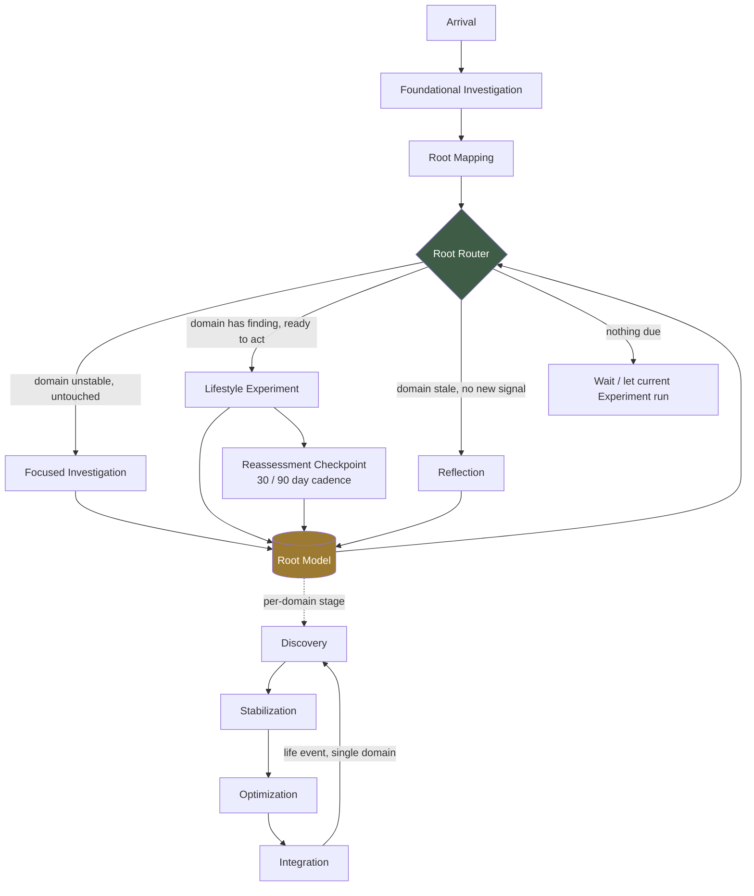

# The Rooted Reset Method

**Coaching Methodology — Architecture Blueprint v2.0**
MEF Wellness · Prompt 1 refinement (architecture only — no questionnaires, no schema, no code)
Status: **draft, pending approval before Prompt 2**

---

## What changed in v2

Version 2 refines Version 1 — it does not replace it. Everything in Version 1 that worked (the
twelve domains, the Investigation contract, the Experiment structure, the Reflection/Reassessment
split, the per-domain stage model, all eight Recommendations) is preserved as-is. Four things were
added or changed:

1. **New §2, The Language of Rooted Reset** — formal definitions for terms the Method already used
   informally (Signal, Pattern, Root Map, Root Model, Confidence, Capacity, and others), so
   Prompt 2+ has one shared vocabulary instead of implicit meaning scattered across sections.
2. **Strengthened Core Philosophy (§1)** — a fourth conviction (curiosity as method, not just a
   step) and a new "note on stance" describing how an experienced holistic coach actually talks
   and paces coaching, not only what the system computes.
3. **The Root Router's guiding question changed** from "what happens next?" to **"what are we
   trying to understand next?"** (§7) — reframing it from a mechanical next-step lookup into a
   diagnostic question, consistent with the Method's coaching philosophy.
4. **New guiding principle in §3** — every investigation must reduce uncertainty about the member,
   or it shouldn't be asked.

All section numbers from §2 onward have shifted by one relative to v1.0 to make room for the new
Language section; cross-references throughout this document have been updated accordingly.

---

## How to read this document

This is the proprietary coaching methodology that will govern every investigation, coaching
pathway, lifestyle experiment, reflection, reassessment, and personalized member journey on the
Rooted Reset platform. It is intentionally implementation-agnostic: it defines *what* the Method
believes and *how* its parts fit together, not table names, question text, or UI. Wherever this
document touches something that already exists in the codebase, it says so explicitly and cites
it, so that Prompt 2+ can treat this as a real constraint rather than a green field.

A word on vocabulary: this document introduces **"investigation"** as the single member-facing
term for any structured information-gathering instrument — what the codebase today variously
calls an assessment, a questionnaire, or a body assessment. Internally these remain whatever they
are; to the member, they are all just part of one Rooted Reset library. No investigation is ever
presented as a third-party questionnaire, certification, or licensed instrument, regardless of
the clinical framework that originally informed its question set — the member experiences one
coach, one method, one library. §2 formalizes this and the rest of the Method's core vocabulary.

---

## 1. Core Philosophy

**Rooted Reset rests on four convictions:**

**1. Symptoms are signals, not problems to silence.** A sleep complaint, a pain pattern, a craving,
a low-motivation week — each is treated as evidence pointing toward an upstream cause, not as a
target for a standalone fix. The Method's job is to keep asking "what is this a symptom *of*"
across domains until it finds something actionable, rather than matching a symptom to a canned
protocol.

**2. Regulate before you optimize.** Nervous system regulation, sleep, and recovery capacity are
the load-bearing walls. The Method will not stack an aggressive nutrition overhaul, a demanding
training block, or a dense habit-change plan on top of a member whose regulation is still
unstable — it stabilizes first ("Reset"), then optimizes. This is a hard sequencing rule, not a
preference: see §7 (Branching Logic) for how it's enforced.

**3. The member is a longitudinal system, not a snapshot.** Every investigation, experiment, and
reflection writes into one continuously-updating model of the member — the **Root Model** — rather
than being scored once and archived. The Method never asks "what did this questionnaire say,"
only "what does the Root Model currently believe, and what would most improve its confidence or
correctness right now."

**4. Curiosity is the method, not just a step.** An experienced coach doesn't collect data to
arrive at a verdict — they stay curious longer than feels efficient, because certainty reached too
early forecloses on findings a slower, more attentive process would have caught. Nothing in the
Method exists to close a case file; it exists to keep understanding a specific person more
accurately over time. This conviction is what §7's Root Router question — "what are we trying to
understand next?" — makes operational: every action the Method takes, including an Experiment or a
Reflection, is chosen for what it will teach the Method about the member, not just for what it
will do to them.

**A note on stance.** Everything above describes *what* the Method believes; how it's delivered
matters just as much. An experienced holistic coach doesn't lead with a verdict — they ask,
listen, reflect back what they're noticing, and let the member confirm or correct it before acting
on it. The Root Model is not a diagnosis engine, and a Root Map is not a lab report: both are
working hypotheses, held loosely, that get more accurate as the member is understood better — not
scores to be defended as "right." Language throughout the Method favors curiosity over certainty
("what we're noticing," "what this might mean," "worth watching") over declarative claims ("you
have," "you are"). This is also why **Capacity** (§2) gates pace: a coach who has earned trust
paces intervention to what the member can actually metabolize right now, not to what the data
alone would technically support.

**Relationship to Root Score.** The platform already computes a daily composite **Root Score**
(`root_score_snapshots`) with momentum and resilience sub-scores. That is the *quantitative pulse*
the Method produces. This document defines the *qualitative and structural engine* — the
investigations, domains, and branching logic, informed by how a skilled coach actually reasons —
that generates the signal Root Score summarizes numerically. The two are one system: Root Score is
what the Method looks like from the outside, compressed to a number a member can glance at. A
coach's judgment, and the Method's underlying curiosity about the member, is what the number can
never fully show.

**Name, read literally.** "Rooted" = every recommendation is grounded in a root-cause
investigation of this specific member's physiology, history, and context — never generic
programming. "Reset" = the default first move for an unstable domain is to restore baseline
regulatory function, not to add a new intervention on top of dysfunction.

---

## 2. The Language of Rooted Reset

The Method uses a small, deliberate vocabulary. Using these words precisely — in coaching content,
in copy, and later in code and schema — keeps "what the system believes" and "what a coach would
say" from drifting apart. Terms are ordered roughly from raw observation up to system-level
concepts.

| Term | Definition |
|---|---|
| **Signal** | A single observed data point tied to the member — a survey answer, a check-in response, a Body Assessment finding, an Experiment outcome. Raw and, on its own, not yet coaching-worthy. |
| **Pattern** | A Signal that recurs or clusters meaningfully — across time, or across domains — and so earns coaching attention. One bad night's sleep is a Signal; three consecutive weeks flagged low is a Pattern. The Method coaches off Patterns, not isolated Signals. |
| **Investigation** | The single member-facing term for any structured information-gathering instrument, Core or Focused (§6). What the member experiences as "answering some questions"; what generates new Signals in bulk. |
| **Reflection** | A short, qualitative, point-in-time pulse — usually experiment-driven — that captures how something felt or went, without the structure of a full Investigation (§9). |
| **Experiment** | The Method's unit of *doing*: a small, time-boxed, single-domain behavior change with a declared hypothesis and outcome (§8). An Experiment's outcome is itself a new Signal, not just a completion checkbox. |
| **Root Map** | The plain-language, per-domain view of what the Method currently believes about a member — priorities, not scores. What a member sees; a human-readable projection of the Root Model. |
| **Root Model** | The single, continuously-updating, longitudinal store of everything learned about a member, across every Investigation, Experiment, and Reflection they've ever done. Never scored once and archived — always superseded, never overwritten. |
| **Confidence** | How sure the Root Model currently is about a given finding. Rises when Signals corroborate each other across sources; decays over time on a per-finding shelf life; a stale finding is low-confidence even if it was never contradicted. |
| **Capacity** | The member's current bandwidth — nervous-system, logistical, emotional — for taking on new coaching load. Distinct from Priority: a domain can be high-priority and the member still low-capacity, in which case capacity wins and the Method paces down (§1, conviction 2). |
| **Priority** | A domain's rank for what needs attention next — a function of finding severity, Confidence, and staleness. What the Root Router (§7) reasons over. |
| **Uncertainty** | What the Method is fundamentally trying to reduce. Every Investigation, Reflection, and Experiment exists to move some part of the Root Model from lower to higher Confidence — see the new guiding principle in §3. |
| **Domain** | One of the twelve independently investigable, independently experimentable areas of a member's life (§5). |
| **Stage** | A domain's position in the long-term arc — Discovery, Stabilization, Optimization, Integration, or Renewal (§10). Tracked per domain, never globally. |
| **Root Router** | The conceptual decision layer that decides what the Method should do next for a member, in service of reducing Uncertainty (§7). |

---

## 3. Guiding Principles

| # | Principle | What it rules out |
|---|---|---|
| 1 | **Root cause over symptom management.** Every recommendation traces to a specific finding in the Root Model, not a generic best-practice. | Stock advice ("drink more water") disconnected from what was actually learned about the member. |
| 2 | **Regulate before you optimize.** Unstable domains (see §1) gate new load in other domains. | Recommending a fasting protocol to a member whose stress/sleep domains are both flagged unstable. |
| 3 | **One unified library.** Every investigation, regardless of underlying engine, is one member-facing collection — never a vendor system, a certification track, or a separate "app within the app." | Cross-selling one investigation as a credential/certification path distinct from "the rest of Rooted Reset." |
| 4 | **Earn the next question.** Nothing is asked of a member without a reason traceable to something already known or a declared member goal. | Front-loading a 90-question intake before demonstrating any value. |
| 5 | **Every investigation must reduce uncertainty about the member.** If an Investigation's answer, whatever it turns out to be, wouldn't change a domain's Priority, Confidence, or the next recommended action, it shouldn't be asked. | Investigations that are thorough-looking but inert — instruments included because they exist, not because their answer would move the Root Model. |
| 6 | **Small, reversible experiments over sweeping prescriptions.** Lifestyle Experiments (§8) default to 1–3 changes over 1–4 weeks. | 12-week meal plans and full lifestyle overhauls as a first move. |
| 7 | **Identity and purpose are load-bearing, not decorative.** Motivation, self-concept, and meaning are first-class coaching domains, not an onboarding-flow nicety. | Treating "why do you want this" as marketing copy instead of coaching data. |
| 8 | **Every signal has a shelf life.** A finding decays in confidence over time and is superseded, never silently overwritten. | Coaching off an 18-month-old finding as if it were current. |
| 9 | **Coaches are amplified, not replaced.** The Method produces coaching intelligence and a recommended next action; a human coach can always override it. | Any point where the system's recommendation is presented as final rather than as a suggestion a coach or member can redirect. |

Principle 5 and Principle 4 are close cousins, deliberately kept separate: Principle 4 governs
*sequencing and consent* (don't front-load), Principle 5 governs *purpose* (don't ask something
whose answer changes nothing). An Investigation can pass one and fail the other.

---

## 4. Coaching Journey

The journey is a sequence of **stages**, but — critically, see §10 — stage is tracked *per domain*,
not just globally. What follows is the member's first pass through the stages; §10 covers what
happens once a member has been through them once.

| Stage | Name | What happens | Exit condition |
|---|---|---|---|
| 0 | **Arrival** | Signup, consent, welcome. Already shipped as the four-screen welcome experience. | Welcome flow complete. |
| 1 | **Foundational Investigation** | The one mandatory, universal investigation (§6). A light touch across every domain — depth is intentionally shallow everywhere rather than deep anywhere. | Foundational Investigation submitted. |
| 2 | **Root Mapping** | The system synthesizes the Foundational Investigation into an initial per-domain Root Map and shows the member what it currently believes, in plain language — not a score dump. | Member has seen their initial Root Map. |
| 3 | **Focused Investigation** | The Root Router (§7) recommends 1–2 domains for a deeper, domain-specific investigation; the member can accept, swap, or self-select instead. | At least one Focused Investigation completed. |
| 4 | **First Experiment** | A single, small Lifestyle Experiment (§8) in the member's top-priority domain — deliberately *before* heavy content-library engagement, so the member's first taste of the platform is doing something, not reading something. | Experiment closed with an outcome. |
| 5 | **Rhythm** | The ongoing loop: Reflections, periodic Focused Investigations, recurring Experiments, coach touchpoints, all sequenced by the Root Router. | Ongoing — this is the steady state. |
| 6 | **Reassessment Checkpoints** | Structured re-runs of completed investigations at their declared cadence (default 30/90 days). | Ongoing, periodic. |
| 7 | **Long-Term Growth** | Domains that have stabilized shift from corrective coaching questions to generative ones (§10). | Per-domain, never global. |

---

## 5. Coaching Domains

Twelve domains. Each is scoped to be independently investigable, independently experimentable,
and independently trackable in the Root Model — a member can be stable in one and just beginning
in another at the same time.

The platform's existing Foundational intake already models five domain clusters
(`sleep`, `mind_stress`, `movement_energy`, `nutrition_digestion`, `pain_structural` —
`lib/onboarding/baseline.ts`). Rather than replace that reference data, the Method's twelve
domains are designed to **map cleanly onto those five as sub-domains**, so the Foundational
Investigation can stay a five-cluster instrument while Focused Investigations and the Root Model
operate at the finer twelve-domain resolution. Two domains (marked **New**) have no existing
cluster to map to — see Recommendation 2.

| # | Domain | Definition | Maps to existing cluster |
|---|---|---|---|
| 1 | **Identity & Self-Concept** | How the member sees themselves in relation to their body and health; history of past attempts; self-efficacy. | *(New — no current cluster)* |
| 2 | **Purpose & Motivation** | The member's "why"; values; what a meaningful day/week looks like to them. | *(New — no current cluster)* |
| 3 | **Stress & Nervous System Regulation** | Perceived stress, regulation capacity, activation/recovery balance. | `mind_stress` |
| 4 | **Emotional Resilience & Mood** | Mood patterns and emotional-regulation strategies, distinct from acute stress load. | `mind_stress` |
| 5 | **Sleep & Circadian Rhythm** | Sleep quality, timing, and consistency; circadian alignment. | `sleep` |
| 6 | **Movement & Physical Capacity** | Strength, mobility, movement variety and frequency. | `movement_energy` |
| 7 | **Recovery & Energy Regulation** | Energy availability across the day/week; recovery from training and life load. | `movement_energy` |
| 8 | **Pain & Structural Integrity** | Pain patterns, posture, structural findings. Primary consumer of Body Assessment data. | `pain_structural` |
| 9 | **Nutrition & Metabolic Health** | Eating patterns, macronutrient balance, metabolic markers where available. | `nutrition_digestion` |
| 10 | **Digestion & Gut Health** | GI symptoms, digestive comfort, gut-related patterns. | `nutrition_digestion` |
| 11 | **Relationships & Social Connection** | Quality and depth of the member's social support and relationships. | *(New — no current cluster)* |
| 12 | **Environment & Daily Rhythm** | Home/work environment, daily routine structure, light and time-of-day exposure. | *(New — no current cluster)* |

Four of the twelve (Identity, Purpose, Relationships, Environment) have no mapping at all. This is
a deliberate finding, not an oversight: it means the Method calls for coaching territory the
platform does not currently instrument anywhere. See Recommendation 2.

---

## 6. Investigation Framework

**Two tiers, one library.**

**Core Investigations** — universal, every member completes them:
- **Foundational Investigation.** The evolution of today's Onboarding Assessment: a light touch
  across all five clusters (twelve domains), designed for breadth over depth. This is what
  populates the member's first Root Map.
- **Whole-Person Check-in.** A short, recurring pulse (not exhaustive) that keeps every domain's
  confidence from decaying to zero even when no Focused Investigation is active there.

**Focused Investigations** — conditional, unlocked per §7:
- One (or a small cluster) per domain: deep, domain-specific instruments. Some already exist in
  spirit today (a nutrition-and-lifestyle-style questionnaire, a four-pillar-style questionnaire, a
  diet-type-style questionnaire, the camera-based Body Assessment); others (Identity, Purpose,
  Relationships, Environment) do not yet exist in any form and would need to be designed from
  scratch in a future prompt.

**Every Focused Investigation, regardless of which engine renders it, declares the same four
things** to the rest of the Method — this is what keeps the framework engine-agnostic and avoids
forcing a premature decision about unifying the platform's several existing assessment engines:

1. **Domain mapping** — which of the twelve domains it primarily informs (can be more than one).
2. **Unlock triggers** — the conditions under which the Root Router is allowed to surface it (§7).
3. **Reassessment cadence** — how often it becomes "due" again once completed.
4. **Root Model contribution** — what shape of signal it hands back: a priority classification,
   a structured metric, or a narrative/qualitative observation.

This contract is intentionally the *only* thing the Method requires of an investigation. It says
nothing about question format, scoring mechanism, or data model — those stay implementation
details owned by whichever engine hosts the investigation. Per the new principle in §3, every
Focused Investigation's design should also be able to answer a fifth, informal question: *what
uncertainty does this reduce that nothing else already answers?*

---

## 7. Branching Logic — the Root Router

The **Root Router** is the conceptual decision layer that answers, at any moment, the question an
experienced coach is always quietly asking: ***what are we trying to understand next about this
member?*** Not "what happens next" — a mechanical next-step lookup — but a genuine diagnostic
question asked before choosing any action. Its output is not always "take an investigation."
Running an Experiment, prompting a Reflection, or deliberately waiting are equally valid answers,
because each is chosen for what it will reveal about the member, not merely for what it will do to
them. Per Principle 5 (§3), whatever the Root Router recommends must be able to say what
uncertainty it's reducing, and where.

**Inputs:** current Root Model state (per-domain priority and confidence/staleness), completed and
in-progress investigations, active experiments, recent reflections, and engagement recency.

**Decision order:**

1. **Safety gate.** No Focused Investigation before the Foundational Investigation is complete.
   No two heavy Focused Investigations back-to-back without a lighter touchpoint between them —
   this protects completion rates and enforces "regulate before you optimize" (§1) by refusing to
   pile investigation load on an already-loaded member.
2. **Priority.** Among unblocked domains, the highest-priority, lowest-investigation-depth domain
   is recommended first.
3. **Recency decay.** A domain untouched for N days loses confidence and rises in priority for at
   least a lightweight Reflection touchpoint, even with no new negative signal — staleness is
   itself a reason to re-engage a domain.
4. **Member agency.** A member's explicit interest in a domain can override the algorithmic order.
   The system still logs what it *would* have recommended, so the Root Model stays honest about
   the gap between "chosen" and "recommended."
5. **Coach override.** A coach pinning or deferring a recommendation for their client always wins
   over the algorithm.

The Root Router is a single named decision layer by design (see Recommendation 6) — the platform
has already accreted four semi-independent assessment engines organically; a framework this
central deserves one clear owner rather than branching logic re-implemented per feature.

---

## 8. Lifestyle Experiment Framework

An Experiment is the Method's unit of *doing*, as opposed to investigating or reflecting.

**Structure:** Hypothesis → Protocol → Tracking → Reflection → Outcome.
- Scoped to **one domain**.
- Small by default: **1–3 changes, 1–4 weeks.**
- Closes with an explicit member-reported outcome — worked / partially worked / didn't work /
  inconclusive — which is itself a new signal written into the Root Model, not just a
  content-completion checkbox.

**Sourcing:** most Experiments are generated from a specific investigation finding (a given
priority flag suggests a specific experiment template); coaches can also hand-author bespoke
Experiments for their clients.

**Guardrails:**
- No more than **two concurrent Experiments** per member, to keep changes attributable.
- A domain with an **active Focused Investigation** doesn't also get a new Experiment opened
  mid-investigation — investigate, *then* intervene, not both at once in the same domain.

---

## 9. Reflection and Reassessment Framework

Two distinct instruments, easy to conflate, kept deliberately separate:

|  | **Reflection** | **Reassessment** |
|---|---|---|
| Nature | Qualitative, short | Quantitative, structured |
| Cadence | Frequent (weekly-ish), usually experiment-driven | Per-investigation declared cadence, default 30/90 days |
| Prompted by | An active Experiment or a general check-in | A Core or Focused Investigation becoming "due" again |
| Compares against | Nothing — it's a point-in-time pulse | The **most recent prior instance** of the same investigation, not just the original baseline, so members see recent trend rather than only total-journey change |

**Both write into the Root Model with a timestamp and a "supersedes" pointer to the prior signal
in that domain — never an overwrite.** This mirrors the append-only pattern already used elsewhere
in the schema (coach notes, coach reviews) and keeps every prior finding inspectable rather than
silently replaced.

The 30/90-day default cadence is not arbitrary — it is the same cadence the platform's Onboarding
data model already reserves a column for (`checkpoint_label`, currently unused). See
Recommendation 4.

---

## 10. Long-Term Member Journey

The arc, in aggregate, looks like:

**Discovery** (~months 0–1) → **Stabilization** (regulate domains flagged unstable, ~1–3 months) →
**Optimization** (address remaining priority domains, ~3–9 months) → **Integration** (habits held
without active tracking; coaching shifts from corrective to generative questions, ~9+ months) →
**Renewal** (a life change — injury, move, new job, new relationship — triggers a return to
Discovery-depth investigation in *one* domain, without resetting the whole journey).

**The critical design decision: stage is tracked per domain, not globally.** A member can be in
Integration for Sleep while still in Discovery for Relationships. The Root Model stores a stage
per domain; any single "your journey stage" shown to the member is a narrative rollup for UX
purposes only, never the system's actual state. This is what makes Renewal cheap — a life event
only needs to reset the *one* affected domain's stage, not the member's entire journey.

In Integration, the Root Router's question style shifts: instead of "what's still wrong," it asks
what's still uncertain that's worth understanding, phrased generatively — "what would make this
domain even better," "what's the next thing you're curious about" — the same decision layer, the
same underlying question ("what are we trying to understand next?"), a different tone of output
once a domain has earned it.

---

## 11. Visual Roadmap

Reading the diagram: the **Root Router** (§7) is the hub every cycle passes through, always asking
"what are we trying to understand next?"; the **Root Model** (§1, §2) is the single accumulating
store every activity writes into and every decision reads from; and the per-domain stage
progression (§10) runs underneath the whole loop, advancing independently for each of the twelve
domains.

---

## Recommendations before any questionnaires or code are created

1. **Reconcile the twelve-domain taxonomy (§5) against the existing five-value onboarding domain
   enum** (`DOMAIN_ORDER` in `lib/onboarding/baseline.ts`). Recommend treating twelve as a
   coaching-layer taxonomy that maps many-to-one onto the existing five clusters (as drafted here)
   rather than expanding the stored enum immediately — lower risk, and defers a schema change
   until the twelve-domain model has been used in practice.

2. **Identity & Self-Concept, Purpose & Motivation, Relationships & Social Connection, and
   Environment & Daily Rhythm have zero existing instrumentation anywhere in the platform's five
   current assessment systems.** These need net-new Focused Investigations designed from scratch —
   flagging now so Prompt 2+ scopes for four new instruments, not zero.

3. **Explicitly resolve whether the platform's several existing assessment engines get unified,
   extended, or left as-is behind the Investigation contract in §6**, before the Investigation
   Framework can become a build plan. This document deliberately doesn't force that decision — the
   four-field contract in §6 works either way — but Prompt 2+ will need to.

4. **Wire up (or formally retire) the dormant `checkpoint_label` / `onboarding_baselines`
   mechanism.** It already models almost exactly the 30/90-day Reassessment cadence proposed in
   §9. Building new reassessment infrastructure alongside a dormant one that models the same idea
   would create drift risk between two systems doing the same job.

5. **Decide whether investigation data should start writing into the platform's existing
   registry/health-profile store**, which today only ingests Body Assessment and coach-intelligence
   data. The Root Model (§1, §2) assumes one longitudinal store; today that store doesn't yet
   ingest investigation-derived signals at all.

6. **Name and scope the Root Router (§7) as a real, single service boundary early.** Branching
   logic that accretes ad hoc, per feature, has already happened once on this platform (several
   parallel assessment engines evolved independently rather than through one shared layer). A
   named owner for "what are we trying to understand next?" prevents that from happening a second
   time.

7. **Decide ownership of Experiment templates** (system-authored, coach-authored, or both) before
   building §8. This determines whether Experiments need an authoring/admin surface at all — which
   is the first real candidate use for the platform's currently-dormant content-repository scaffold
   — or can ship as static, code-defined content for v1.

8. **Pressure-test the per-domain stage model (§10)** against a handful of real members' data
   before committing to it structurally. It's the most architecturally novel idea in this document
   and the one most likely to need revision once real journeys — not hypothetical ones — are
   observed.

---

*End of Prompt 1 deliverable, Version 2. Awaiting approval before Prompt 2.*
