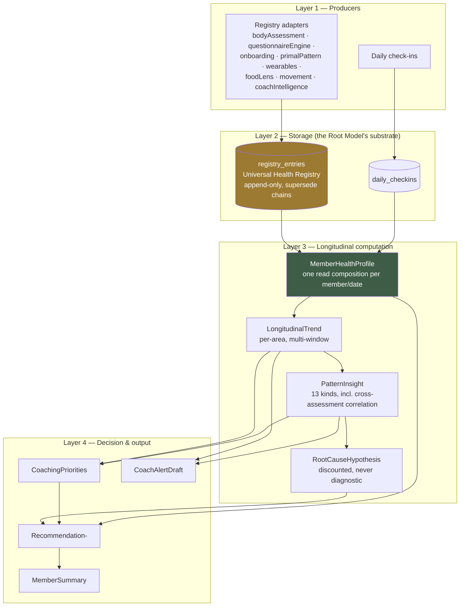
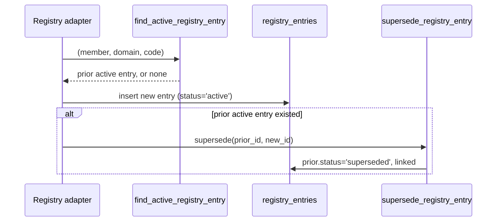
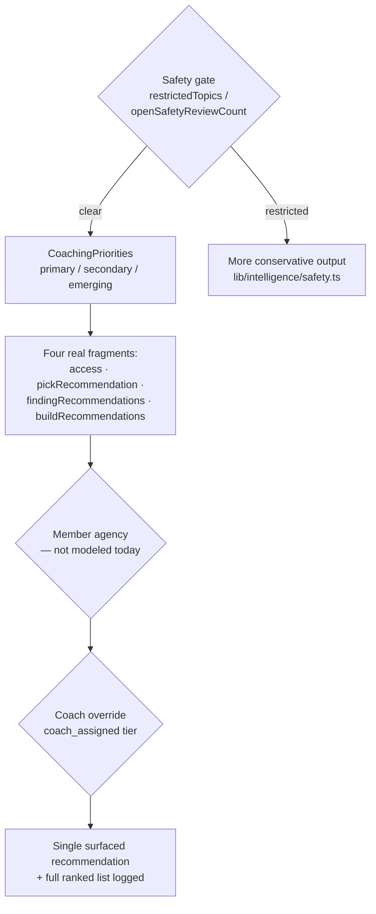
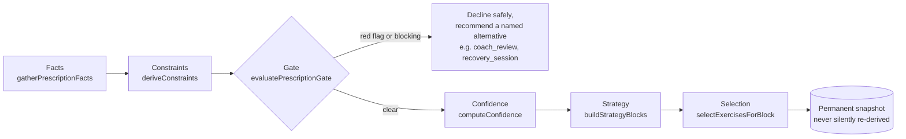

# The Root Model and Root Router Intelligence Engine — Architecture

**Prompt 6 deliverable — architecture and specification only (no code, no migrations, no
implementation)**
MEF Wellness · Governed by [The Rooted Reset Method, v2](./METHODOLOGY.md),
[the Focused Investigation Library](./FOCUSED-INVESTIGATION-LIBRARY.md)
Status: **draft, pending approval before Prompt 7**

---

## 0. How to read this document — a major finding, up front

Prompt 5 found that the Method's Root Model already has a real substrate (the Universal Health
Registry) and that the Root Router's job was already split across three real modules. This
document goes one level deeper and finds something bigger: **almost everything this prompt asks
for — findings accumulating over time, confidence calculation, pattern recognition, cross-domain
relationships, recommendation priority, coach escalation, learning from member history — already
exists, in real, live, deterministic code, under the name "the MEF Intelligence Engine"**
(`lib/intelligence-engine/`), which composes six subsystems that were each already built for
other reasons:

| Real subsystem | What it already does |
|---|---|
| Universal Health Registry (`lib/registry/`) | Findings storage, supersede chains, Pattern Timeline (Prompt 5) |
| Personal Wellness Intelligence Engine (`lib/intelligence/`) | Per-metric trend classification, strength/pattern detection over daily check-ins |
| Coaching Brain (`lib/brain/`) | Today's single deterministic coaching-focus decision |
| Member Health Narrative (`lib/narrative/`) | Evolving structured understanding of the member over time |
| Coaching Safety (`lib/safety/`) | Restricted topics, Coach Review Queue |
| Daily Coaching Feed (`lib/feed/`) | Streak/adherence/history |

**This document is therefore primarily a reconciliation, not a green-field design**: for every
concept the prompt asks for, it names the real code that already implements it, the real formula
or threshold already in use, and — honestly — what's genuinely still missing. Where this document
proposes something new, it's flagged as new; everywhere else, it's citing what's already there.

**Terminology collision, restated more strongly than in Prompt 5.** Several of the files this
document relies on carry their own docblock referencing **"Prompt 6"** —
`lib/intelligence-engine/rootCauseSignals.ts`, `crossAssessmentCorrelations.ts`, and
`lib/registry/timeline.ts` all say so explicitly. That is the *Universal Assessment Intelligence
Engine*'s own, already-completed build sequence — unrelated to this Method's numbering, and now
directly, unavoidably relevant to *this* Prompt 6's own subject matter. Every citation below to
that prior work is written as **"the Assessment Intelligence Engine's Prompt 6"**, never bare
"Prompt 6."

---

## 1. The complete Root Model architecture

**Reconciliation — Method concept → real implementation:**

| Method v2 term | Real implementation | Notes |
|---|---|---|
| Signal | `RegistryEntry` (point-in-time finding) or one `DailyCheckin` datapoint | Two producers, one downstream profile. |
| Pattern | `trend_status` (single-chain, Prompt 5) **and** `PatternInsight` (multi-signal, 13 kinds — §5) | Richer than Prompt 5 alone showed. |
| Root Model | `registry_entries` (substrate) + `MemberHealthProfile`/`MemberIntelligenceReport` (computed view) | Two layers, not one — see §1's diagram. |
| Confidence | Real 0–1 numeric, computed close to source, never fabricated (§3) | Multiple real formulas, reconciled in §3. |
| Root Map | **No direct real equivalent.** Closest: `MemberSummary` + `CoachingPriorities`, both coach-facing today | Genuine gap — see closing recommendations. |
| Root Router | **No single named service.** Four real fragments (§7) | Method Recommendation 6, now demonstrated a fourth time. |
| Capacity | **No direct field.** Closest real proxies: `AdherenceInfo`, `StreakInsight` | Gap, not a match — flagged honestly. |
| Uncertainty | `MIN_CONFIDENCE_TO_SURFACE` / `MIN_CONFIDENCE_TO_PERSIST` gates | Low-confidence output is suppressed, not shown weakly. |

---

## 2. How findings accumulate over time

Accumulation is **append-only, never edit-in-place**, via `lib/registry/data.ts`:

- `insertRegistryEntry()` always inserts a fresh row.
- `findActiveRegistryEntry()` is the dedup check — is there already an active `(member, domain,
  code)` entry to supersede, or is this genuinely new.
- Supersession goes through a `supersede_registry_entry` **RPC**, deliberately not a direct
  `.update()` — the codebase's own comment on this is worth citing verbatim: marking a row
  `superseded` moves it outside the member's own `status = 'active'` read policy, and Postgres row
  security requires an `UPDATE`'s *resulting* row to still satisfy the table's SELECT policy for
  the executing role — so the RPC bakes the authorization check into a `SECURITY DEFINER` function
  instead of fighting RLS with a plain update. Any future accumulation mechanism this document's
  successors design should follow the same RPC-for-supersession pattern, not rediscover the same
  RLS trap.
- `buildFindingTimeline()` (the Assessment Intelligence Engine's Prompt 6 "Pattern Timeline")
  groups a member's *entire* history (all statuses, not just active) by `(domain, code)` and
  produces, per chain: `firstObservedAt`, `lastObservedAt`, `occurrenceCount`, current
  `trend_status`, `resolvedAt`, and `confidenceOverTime` — a full longitudinal read, computed
  fresh from the append-only chain, never a separately-maintained table.

---

## 3. Confidence calculation

Three real, distinct-but-composable mechanisms, not one formula:

1. **Per-entry confidence (0–1), grounded close to source.** `questionnaireEngine.ts`'s
   established convention (Prompt 5 §6): position within the result's own severity band, fixed
   range. `confidenceFromSample()` (`lib/intelligence/confidence.ts`) is the trend-detector
   equivalent: `min(0.5 + sampleSize / 30, 0.9)` — confidence grows with real sample size and is
   **capped at 0.9, never asserted as certainty**, regardless of how much data exists.
2. **Discounting when inferring a relationship.** `HYPOTHESIS_DISCOUNT = 0.85` — every
   `RootCauseHypothesis` multiplies its inputs' confidence by this factor, because inferring a
   *relationship* between two real trends is always less certain than either trend on its own.
   This is a real, tuned number worth reusing anywhere the Method's own §7 reasoning ("what would
   reduce uncertainty") produces an inference rather than a direct observation.
3. **Cross-instrument corroboration boost.** `crossAssessmentCorrelations.ts`'s real formula:
   `min(0.9, average(confidenceA, confidenceB) + 0.1)`. **This corrects Prompt 5 §6's proposed
   rule** ("a `moderate` floor granted when two independent investigations corroborate") with the
   real, already-implemented one: corroboration doesn't grant a flat floor, it *boosts the average*
   by a fixed 0.1, still capped at 0.9. Future Focused Investigations' Contract (§4 of Prompt 5)
   should cite this exact formula, not the earlier proposal.

**Two hard floors gate what ever surfaces at all:** `MIN_CONFIDENCE_TO_SURFACE = 0.5` (hypotheses)
and `MIN_CONFIDENCE_TO_PERSIST = 0.55` (trend-engine insights) — "prefer showing no insight over
showing an unreliable one," the codebase's own stated principle, and a direct, independently-arrived-at
match for Method v2's "held loosely, not scored" stance.

**Label mapping**, unchanged from Prompt 5: `CONFIDENCE_THRESHOLDS` (`low: 0.25, moderate: 0.5,
high: 0.75`, `lib/scoring/config.ts`) remains the one standard numeric-to-`building`/`low`/
`moderate`/`high` mapping — every number above should be read through it when shown in the
Method's own vocabulary.

---

## 4. Signal aging and decay

There is no single "decay" formula — aging is handled at three different layers, each real:

- **Window-based dilution.** `LongitudinalTrend`'s six windows (`last_7_days` through
  `since_reassessment`) mean an old data point's influence shrinks simply by falling out of the
  shorter windows over time, without ever being deleted. `MIN_SAMPLE_FOR_WINDOW` (e.g., 4 check-ins
  minimum for a 7-day trend, 20 for 90 days) means a too-sparse window just returns
  `insufficient_data` rather than a falsely-confident stale read.
- **Explicit staleness thresholds.** `ASSESSMENT_OVERDUE_DAYS = 90` (`daysSinceLastReassessmentOrBaseline`)
  and `NO_CHECKIN_ALERT_DAYS = 5` are real, named "this has gone stale" triggers that produce an
  explicit recommendation/alert — the concrete mechanism behind Method principle 8 ("every signal
  has a shelf life"), already built, just not previously connected to that language.
- **Root Score's own decay**, unchanged from Prompt 5: a 30-day rolling window plus
  `MAX_ROOT_SCORE_DAILY_CHANGE = 6` as a structural anti-gaming ceiling.

**Real gap, flagged honestly:** none of the above ever writes a *decayed* confidence value back
onto a stored `registry_entries` row. A five-month-old, never-superseded finding still carries
whatever confidence it was written with — staleness is only ever handled by the *consumer*
(windows, overdue thresholds), never by the record itself. Whether that's sufficient permanently,
or whether `registry_entries` eventually needs its own decay-of-confidence-over-time mechanism, is
listed in this document's closing recommendations rather than decided here.

---

## 5. Pattern recognition

`PatternKind` already has **thirteen** real values: `weekend_adherence`, `missed_checkins`,
`recovery_after_setback`, `effective_coaching_strategy`, `repeating_barrier`,
`post_reassessment_change`, `domain_relationship`, `consistency_improvement`,
`lifestyle_disruption`, `burnout_signal`, `plateau`, `body_assessment_finding`, and
`cross_assessment_correlation`. Most are pass-throughs of `lib/intelligence/patternEngine.ts`
detectors (`sourceInsightId` set, "never re-derived, just re-shaped"); `burnout_signal` and
`plateau` are genuinely new to this engine.

Every `PatternInsight.description` is written in a **correlation-safe voice** — "tends to coincide
with," never "causes" — a real, enforced discipline (`lib/intelligence/copy.ts`), and directly the
Method's own "coach, not diagnostician" stance (v2 §1's "note on stance"), independently arrived
at in code before this document series existed.

---

## 6. Cross-domain relationships

Two real, distinct mechanisms, operating at different levels of interpretation:

**Level 1 — Correlation (co-occurrence, no interpretation).** `CORRELATION_RULES`
(`crossAssessmentCorrelations.ts`) is a fixed, reviewed list — five real rules today:

| Rule | Domain A | Domain B |
|---|---|---|
| `poor_sleep_high_stress` | sleep (poor quality / circadian disruption) | stress (elevated / emotional wellbeing concern) |
| `neck_pain_forward_head` | movement (neck/upper-back pain) | posture (forward head) |
| `hip_instability_knee_pain` | movement (hip asymmetry) | movement (hip/knee pain) |
| `digestive_complaints_stress` | nutrition (digestive complaints) | stress (elevated / emotional wellbeing concern) |
| `shoulder_mobility_breathing` | posture (rounded/elevated shoulder) | breathing (breathing pattern) |

A rule fires only when **both** sides have a real active finding — "a single fact is not a
correlation." A sixth, dynamic rule (`buildMovementReadinessCorrelation`) pairs a movement-domain
*finding* with a *declining* movement `LongitudinalTrend`, showing correlation isn't limited to
two registry entries — a finding and a trend can corroborate each other too.

**Level 2 — Hypothesis (interpretation, always with an alternative).** `hypotheses.ts` adds three
hard-coded domain-pair hypotheses (stress+sleep, pain+movement, stress+digestion) plus
pattern-derived ones (burnout, plateau, consistency barrier) — each one required to state known
facts, likely patterns, *and* at least one alternative explanation, discounted per §3. This is
Level 1's "these co-occur" turned into "here's a coaching-relevant read of that, held loosely."

Together, these **are** the Method's "cross-domain relationships" requirement — already real,
already reviewed, already voiced correctly.

---

## 7. Root Router decision engine

**Confirmed, more concretely than Prompt 5 could show: the Root Router's job is split across
*four* real modules, not three.**

| Real module | Decides |
|---|---|
| `lib/assessment-registry/access.ts` | Can this member even start this investigation (eligibility). |
| `lib/assessment-registry/recommendation.ts` (`pickRecommendation`) | Which single investigation to surface next, by status rank. |
| `lib/assessment-registry/findingRecommendations.ts` | Which *other* investigations a member's findings suggest. |
| `lib/intelligence-engine/recommendations.ts` (`buildRecommendations`) | **The richest one** — 9 rule-based builders spanning 14 `RecommendationDomain` values (movement, recovery, breathing, sleep, stress, hydration, nutrition, reflection, education, assessments, coach_follow_up, daily_coaching, conversation_prompts, notifications, automation), each confidence- and priority-scored, each citing its own evidence. |

**Mapped onto Method §7's five-step order** — every step already has a real anchor except one:

1. Safety gate → `restrictedTopics` / `openSafetyReviewCount`, already computed into
   `MemberHealthProfile` (established Prompt 5).
2. Priority → `CoachingPriorities` (already real).
3. Recency decay → `ASSESSMENT_OVERDUE_DAYS`, `NO_CHECKIN_ALERT_DAYS` (§4).
4. **Member agency → not modeled.** No field logs "the member chose X when Y was recommended,"
   the exact honesty check Method §7 calls for. Real gap.
5. Coach override → `coach_assigned` (highest tier in `pickRecommendation`), `CoachAlertDraft`.

**Recommendation, carried forward from Prompt 5 with a sharper edge now:** when the Root Router is
finally named as one real service, it should **orchestrate these four in the order above**, not
add a fifth parallel system. `buildRecommendations()` in particular is close enough to a Root
Router's actual output shape (domain + priority + confidence + evidence) that unifying around *its*
data shape, rather than inventing a new one, is the lower-risk path.

---

## 8. Recommendation priority

Real, already-tuned ladder, from `CoachingPriorities` and `priorityFor()`:

- `primaryPriority` area → `high`
- `secondaryPriority` or `emergingConcern` area → `medium`
- everything else → `low`

At the coach-attention level, `recommendedCoachAttentionLevel` is a real four-value scale —
`priority` / `discuss` / `monitor` / `none` — each with its own plain-language reason
(`ATTENTION_LEVEL_REASON` in `lib/intelligence-engine/engine.ts`), e.g. `priority` →
*"[Area] is an important-severity concern that warrants direct coach attention."* This is the
Method's three-value Priority (`quiet`/`worth watching`/`needs attention now`, Prompt 4 §4)
**already implemented as a slightly richer four-value version** — worth reconciling the two
explicitly (Prompt 4's three-value scale can be read as a simplification of this real one, not a
competing one) rather than letting them drift.

---

## 9. Experiment selection

**No general-purpose Lifestyle Experiment selection engine exists across every Coaching Domain
today.** The closest, most mature real precedent is the **Prescription Intelligence Engine**
(`lib/prescription-intelligence/`) — but it's scoped specifically to movement/exercise
prescriptions, not the Method's broader multi-domain Experiment concept.

It's still the right template to generalize, because its shape is already exactly right:

The gate's own framing is worth quoting directly: *"A red flag, a blocking constraint, a missing
baseline, or truly no usable signal means the engine declines to prescribe at all and instead
recommends a specific alternative, rather than guessing at a workout with unsafe or insufficient
information."* That is precisely Method §7's safety-gate requirement, and precisely the "decline
rather than guess" discipline Prompt 4 §3/§10 and Prompt 5 §12 already established for
investigations — arrived at independently, for a different domain, with the same conclusion.

**Recommendation:** generalize this exact six-stage shape (facts → constraints → gate →
confidence → strategy → selection → permanent snapshot) as the standard pattern for Lifestyle
Experiment selection in *every* Coaching Domain — not a rebuild, a re-application of an
already-proven shape.

---

## 10. Reassessment scheduling

Prompt 5 §8 found `reassessment_schedules` real but empty, with `pickRecommendation()` already
reading from it. This document finds a **second, independent, not-yet-reconciled mechanism**:
`assessmentsRecommendation()` in `intelligence-engine/recommendations.ts` already produces a real
"request a reassessment" recommendation, entirely from `daysSinceLastReassessmentOrBaseline ≥
ASSESSMENT_OVERDUE_DAYS (90)` — a blunt, single-cadence, not-per-instrument heuristic, computed
independently of the dormant scheduler.

**These two need to be reconciled, not left running in parallel.** Once the Method §6-declared,
per-investigation cadence (Prompt 5 §8) is real and the scheduler populates
`reassessment_schedules`, the 90-day blanket heuristic should defer to it (or be repurposed as the
fallback for investigations that haven't declared a specific cadence), not continue operating as a
second, disagreeing source of "is a reassessment due."

---

## 11. Root Score generation

Unchanged principle from Prompt 5 §16 — Root Score should only ever be influenced *indirectly*,
through behavior an investigation or Experiment produces, never written to directly, and
`MAX_ROOT_SCORE_DAILY_CHANGE` structurally enforces that regardless of intent.

**One correction to Prompt 5's own accounting, found here:** Prompt 5 named four domain
vocabularies. There is a **fifth** — `WellnessMetricKey`/`WellnessArea`
(`sleep`, `stress`, `energy`, `mood`, `hydration`, `digestion`, `movement`, `pain` —
`LONGITUDINAL_METRIC_AREAS`), the vocabulary `LongitudinalTrend` and most of
`intelligence-engine/`'s daily-check-in-driven analysis actually runs on. It overlaps but doesn't
match `RegistryDomain`, `ScoreDomainKey`, the Method's 12, or Onboarding's 5. The full, corrected
table:

| Vocabulary | Values | Used for |
|---|---|---|
| Onboarding's 5 clusters | sleep, mind_stress, movement_energy, nutrition_digestion, pain_structural | Stored `onboarding_questions.domain` |
| Method's 12 Coaching Domains | See Method v2 §5 | Coaching-layer taxonomy, app-layer only |
| `RegistryDomain` | posture, movement, breathing, questionnaire, sleep, stress, nutrition, wearable, lab, hormone | `registry_entries.domain` |
| `ScoreDomainKey` | recovery, stress, nutrition, movement, consistency | Root Score's `DOMAIN_WEIGHTS` |
| **`WellnessMetricKey` / `WellnessArea`** *(new to this document)* | sleep, stress, energy, mood, hydration, digestion, movement, pain | `LongitudinalTrend`, most of `intelligence-engine/`'s recommendation logic |

No new stored enum should be created to unify these five — same reasoning as Prompt 5's §7,
applied again. Any future Root Router implementation needs explicit, small mapping tables between
whichever of the five it's reading from and whichever it's writing to, not a single merged
vocabulary.

---

## 12. Coach overrides

Real and already working: `coach_assigned` is `pickRecommendation()`'s **highest** priority tier —
a human decision already wins over every algorithmic signal, live, today. `CoachAlertDraft` rows
persist into `intelligence_coach_alerts` (upserted, so a still-relevant alert doesn't duplicate).
`coachReviewRequired` (Prompt 5 §9) gates member-visible results behind human review for Template C
instruments.

**Gap, unchanged from Prompt 5 §9:** there is still no real field for a coach to *pin* or *defer* a
specific recommendation the way Method §7 step 5 describes — `coach_assigned` covers "do this
instead," not "suppress that other suggestion for now, I've got a reason." Still open.

---

## 13. Safety escalation

Unchanged mechanism from Prompt 4/5 (`safety_classifications`, Coach Review Queue), with one
elegant real detail worth citing as the standard pattern going forward: `openSafetyReviewCount`
and `coachNotesCount` on `MemberHealthProfile` are **RLS-driven, not application-logic-driven** — a
member-triggered profile gather sees `0` for both (because `safety_review_queue` simply has no
member `SELECT` policy), and a coach/admin-triggered gather sees the real counts. Deny-by-default
falls naturally out of the database's own access control, not an `if (role === 'member')` check
that a future refactor could accidentally drop. Any new safety-adjacent field this Method's future
prompts propose should be built the same way — visibility as a property of RLS, not of calling
code remembering to check a role.

---

## 14. Learning from member history

This is, functionally, what most of `lib/intelligence-engine/` already *is* — Method v2 §1's third
conviction ("the member is a longitudinal system, not a snapshot") realized in real code before
this Method existed to name it:

- `LongitudinalTrend` — the same area's read across six real historical windows at once.
- `PatternInsight` kinds like `repeating_barrier`, `effective_coaching_strategy`,
  `recovery_after_setback`, and `consistency_improvement` are literally "what has and hasn't worked
  for this specific member before" — the Method's own language for this, almost verbatim.
- `FindingTimelineEntry`'s `occurrenceCount` and `confidenceOverTime` — how many times has this
  exact finding recurred, and how has confidence in it moved.
- `intelligence_profile_snapshots` — an **append-only** historical record of what the engine
  concluded at each point in time. Nothing is ever overwritten; history is a sequence of snapshots,
  the same discipline `registry_entries`' supersede chains already established at the finding
  level, now at the whole-report level.

---

## 15. Versioning

Unchanged debt from Prompt 5 §17 (`currentVersion`/`versionLockingRequired` real but
unenforced) plus `SCORE_VERSION` for Root Score. The one new, positive precedent this document
adds: `intelligence_profile_snapshots`' append-only design **is itself a versioning strategy** —
rather than versioning a schema, version by never overwriting. Every computation is a new,
immutable, timestamped row; "what did the engine believe on date X" is answered by reading history,
never by reconstructing it. Any future Root Model versioning question should default to "add a new
immutable snapshot" before reaching for a schema version bump.

---

## 16. Future extensibility

`MemberHealthProfile`'s own docblock states its extensibility design outright: *"a future
wearable/lab-work/body-scan integration only needs to extend `MemberHealthProfile` with its own
new field."* That's already the right shape — this document doesn't need to propose a new one.

What a new Focused Investigation (per the Prompt 5 library) needs to do to participate:

1. Get a Registry adapter (Prompt 5 §7) — automatic participation in accumulation (§2), pattern
   detection (§5), and cross-domain correlation (§6) if its domain/code pairs match an existing
   `CORRELATION_RULES` entry, or a new one is added.
2. Only get a `WellnessMetricKey`/`LongitudinalTrend` area if it produces genuinely repeating,
   daily-ish signal — a point-in-time investigation result stays a registry finding, not a trend;
   conflating the two would misrepresent what "confidence growing with sample size" (§3) actually
   means.
3. Declare its reassessment cadence into the *real* scheduler once it exists (§10), not the blunt
   90-day heuristic.

---

## 17. Real example — tracing one member through the whole pipeline

A member has completed Body Assessment (finding: `posture: forward_head`) and the Onboarding
Assessment (finding: `sleep: poor_sleep_quality`, from a low `baseline_sleep_quality` score), and
has been logging daily check-ins showing a declining `stress` trend.

1. **Accumulation (§2).** `bodyAssessment.ts` and `onboarding.ts` each write their finding via
   `insertRegistryEntry` — no prior active entry for either `(domain, code)` pair, so nothing is
   superseded, both are simply new.
2. **Trend (§4).** `classifyMetricTrend()` reads the check-in history and classifies `stress` as
   `declining` over the last 30 days, with confidence from `confidenceFromSample()` based on how
   many check-ins exist.
3. **Correlation (§6, Level 1).** `poor_sleep_high_stress` doesn't fire yet — it needs an active
   *stress-domain* registry finding, and this member only has a declining stress *trend*, not a
   stress finding. But if a later Focused Investigation (a Short Health Assessment Questionnaire
   result, say) writes an active `stress: elevated_stress` entry, the rule fires immediately on
   the next computation — confidence = `min(0.9, average(sleepConfidence, stressConfidence) +
   0.1)`.
4. **Hypothesis (§6, Level 2).** If the `stress` trend and a `sleep` trend are *both* declining
   (not just one finding), `pairedDeclineHypothesis('stress', 'sleep', ...)` fires: confidence =
   `min(sleepTrend.confidence, stressTrend.confidence) × 0.85`. If that clears `0.5`, the member
   gets a real hypothesis: *"Elevated stress may be contributing to reduced sleep quality, or
   reduced sleep may be contributing to elevated stress,"* with an explicit alternative
   ("an unrelated third factor... could be driving both independently").
5. **Priority (§8).** If `stress` is the member's `primaryPriority`, every stress-related
   recommendation gets `high`.
6. **Recommendations (§7).** `areaDrivenRecommendations` fires a `stress`/`breathing`-domain
   recommendation citing the trend directly; `conversationPromptRecommendation` surfaces the
   hypothesis itself as a suggested Conversation Coach prompt; if `recommendedCoachAttentionLevel`
   reaches `priority`, `coachFollowUpRecommendation` and `notificationsRecommendation` both fire.
7. **Coach view.** `buildRootCauseSignalsView` (the Assessment Intelligence Engine's Prompt 6 "Root
   Cause Signals") shows the coach the enriched hypothesis (which real assessments back it — here,
   Onboarding and, once it exists, a stress-producing Focused Investigation), the correlation
   itself, the full finding timeline for both `(domain, code)` chains, and
   `suggestAssessmentsFromFindings` (Prompt 5 §13) suggesting Four Doctors Assessment next, since
   `stress` is one of its `DOMAIN_ROUTES` targets.
8. **Safety.** None of this triggers `safety_classifications` — sleep/stress findings at
   `moderate` severity don't map to a restricted topic (only `pain` and `mood` do, per Prompt 4
   §10) — so this stays a normal coaching flow, not an escalation, exactly as it should.

---

## Recommendations before Prompt 7

1. **Name the Root Router as one real service, orchestrating the four fragments in §7's order** —
   Method Recommendation 6, now demonstrated a fourth time with a fourth real module found.
2. **Reconcile the two independent "is a reassessment due" mechanisms** (§10) before either one is
   extended further.
3. **Decide whether `registry_entries` needs its own confidence-decay-over-time mechanism** (§4),
   or whether window-based consumption is judged sufficient permanently.
4. **Generalize the Prescription Intelligence Engine's six-stage shape** (§9) to non-movement
   Lifestyle Experiments — the pattern is proven, just narrowly scoped today.
5. **Model coach pin/defer as a real field** (§12) — still open from Prompt 5.
6. **Build a genuine member-facing Root Map.** The coach-facing "Root Cause Signals" view is real
   and rich; nothing equivalent renders to the *member* today — Prompt 4 §8's member-facing Root
   Map copy currently has no real data source to read from beyond the Foundational Investigation's
   own submission.
7. **Record the fifth domain vocabulary** (`WellnessMetricKey`/`WellnessArea`, §11) permanently
   alongside the other four — this document's correction to Prompt 5's own accounting.

---

*End of Prompt 6 deliverable. Awaiting approval before Prompt 7.*
